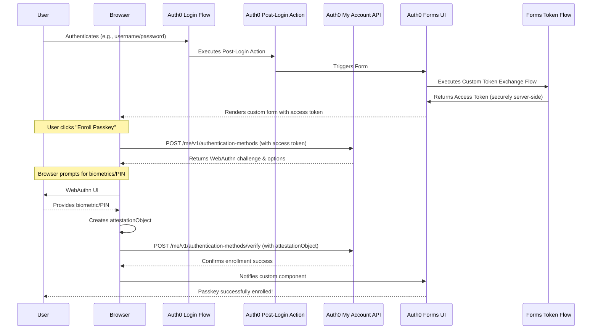

# Custom Passkey Enrollment in Auth0

This document provides a comprehensive, step-by-step walkthrough for implementing a custom passkey enrollment flow using Auth0 Forms, Auth0 Actions, and the Auth0 My Account API. This solution is necessary when you need to trigger passkey enrollment at a specific point in the user's lifecycle, rather than during initial signup. A common use case is giving an authenticated user the option to add additional passkeys to their account.

## Overview

The standard Auth0 passkey enrollment is designed to trigger in certain ways, such as during the initial sign-up. This solution gives you complete control over when and where the enrollment occurs.

### How It Works

Our custom flow follows these steps:

1. **User Authentication**: A user completes a standard login to your application
2. **Action Trigger**: An Auth0 post-login Action runs, checks a condition (e.g., if the user has enrolled a passkey yet), and triggers a custom Auth0 Form
3. **Token Exchange**: The form uses Custom Token Exchange to get a privileged access token for the My Account API (most secure method as the client secret remains server-side)
4. **Enrollment Initiation**: The form's custom component initiates the passkey enrollment process
5. **WebAuthn Challenge**: The custom component calls the My Account API to get a WebAuthn challenge
6. **Passkey Creation**: The browser uses the WebAuthn API (`navigator.credentials.create`) to prompt the user to create a passkey
7. **Attestation**: The browser sends the WebAuthn attestationObject back to the custom component
8. **Verification**: The component verifies this attestationObject with the Auth0 My Account API, completing the enrollment

> **Note**: This flow is possible due to the extensibility of Auth0 Forms and Actions, and the new capabilities of the My Account API (currently in Early Access).

## Prerequisites

Before implementing this solution, ensure you have:

- **Auth0 Tenant**: An Auth0 Tenant with a Custom Domain configured. Passkeys are tied to a specific domain, and a custom domain prevents invalidation if the tenant URL changes
- **API Testing Tool**: A Postman account or similar API testing tool
- **Application**: A custom application to host the authentication flow (e.g., a Single-Page Application)
- **API Access**: Your application must be able to securely obtain an access token with the necessary scope for the My Account API

## Auth0 Dashboard Configuration

Before writing any code, we need to set up our Auth0 tenant.

### Create a WebAuthn Connection

This is the connection where Auth0 will store the passkey credentials.

1. In the Auth0 Dashboard, go to **Authentication > Database**
2. Select a database connection (or create a new one)
3. Go to the **Authentication Methods** tab and enable the **Passkeys** toggle
4. Go to **Settings** and ensure **Requires Username** is disabled

### Create a Custom Auth0 Form

This form will contain the custom component that handles the passkey enrollment.

1. Go to **Branding > Forms > Library**
2. Select **Create Form** and choose an appropriate form type (e.g., "Blank Form")
3. In the form editor, add a **Custom Component** node

> **Note**: The full JSON export for a form that implements this flow is available in the file `cte_ul_npk.json`.

### Configure the Application with My Account API Scopes

Your application will need an access token that allows it to interact with the My Account API on behalf of the user.

1. In the Auth0 Dashboard, go to **Applications > APIs**
2. Find the **MyAccount API** and ensure it is activated
3. Go to **Applications > Applications** and select the application where you will be using this flow
4. In the application settings, go to the **APIs** tab
5. Find the **MyAccount API**, enable it, and grant your application the `create:me:authentication_methods` scope

> **Important**: This is a crucial step to allow the creation of new passkeys.

## Auth0 Actions: The Brain of the Operation

This Action will be used to trigger the custom form at the right time. It should be configured to run in the post-login flow.

### Setup Steps

1. In the Auth0 Dashboard, go to **Actions > Flows**
2. Select the **Login** flow
3. Add an Action to the flow. Name it `trigger-passkey-form`
4. In the code editor, implement the logic to decide when to render the form

### Action Code

The `api.prompt.render()` method is used to show a form to the user:

```javascript
/**
 * Handler that will be called during the execution of a PostLogin flow.
 *
 * @param {Event} event - Details about the user and the context in which they are logging in.
 * @param {api} api - Interface whose methods can be used to change the behavior of the flow.
 */
exports.onExecutePostLogin = async (event, api) => {
  // Check if the user has already enrolled a passkey.
  // This is a simplified check. You may use user_metadata or other logic.
  const hasPasskey = event.user.authenticationMethods.some(
    (method) => method.type === 'passkey'
  );

  if (!hasPasskey) {
    // The Action's only job is to render the form, which will handle its own token exchange.
    // Replace 'FORM_ID' with the actual ID of the custom form you created.
    api.prompt.render('FORM_ID');
  }
};
```


## The Custom Auth0 Form Component

The code for the form's custom component will handle the WebAuthn API calls and communication with the My Account API. This is the core of your client-side implementation. The code is placed inside the Custom Component block within the Auth0 Forms editor.

> **Implementation**: The full code for this custom component, including the UI and the logic for interacting with the My Account API, can be found in a separate file named `form_component.js`.

## Postman Collection for Testing

This collection includes requests for both **Custom Token Exchange setup/testing** and **My Account API testing** for the complete passkey enrollment flow.

> **Resource**: The full Postman collection is provided in a separate file named `postman_collection.json`.

### Custom Token Exchange Requests

These requests are essential for configuring and testing the Custom Token Exchange flow that enables secure token acquisition in Auth0 Forms.

#### Setup & Configuration

**1. Get Management API Token**
- **Method**: `POST`
- **URL**: `https://{{YOUR_AUTH0_DOMAIN}}/oauth/token`
- **Headers**: `Content-Type: application/x-www-form-urlencoded`
- **Body**:
  ```
  grant_type=client_credentials
  client_id={{MANAGEMENT_API_CLIENT_ID}}
  client_secret={{MANAGEMENT_API_CLIENT_SECRET}}
  audience=https://{{YOUR_AUTH0_DOMAIN}}/api/v2/
  ```

**2. Enable Custom Token Exchange on Application**
- **Method**: `PATCH`
- **URL**: `https://{{YOUR_AUTH0_DOMAIN}}/api/v2/clients/{{CLIENT_ID}}`
- **Headers**: 
  - `Content-Type: application/json`
  - `Authorization: Bearer {{MANAGEMENT_API_TOKEN}}`
- **Body**:
  ```json
  {
    "token_exchange": {
      "allow_any_profile_of_type": ["custom_authentication"]
    }
  }
  ```

**3. Get Action ID**
- **Method**: `GET`
- **URL**: `https://{{YOUR_AUTH0_DOMAIN}}/api/v2/actions/actions?actionName={{ACTION_NAME}}`
- **Headers**: `Authorization: Bearer {{MANAGEMENT_API_TOKEN}}`

**4. Create Custom Token Exchange Profile**
- **Method**: `POST`
- **URL**: `https://{{YOUR_AUTH0_DOMAIN}}/api/v2/token-exchange-profiles`
- **Headers**:
  - `Content-Type: application/json`
  - `Authorization: Bearer {{MANAGEMENT_API_TOKEN}}`
- **Body**:
  ```json
  {
    "name": "passkey-form-token-exchange",
    "subject_token_type": "urn:auth0:form:token-exchange",
    "action_id": "{{ACTION_ID}}",
    "type": "custom_authentication"
  }
  ```

#### Profile Management

**5. Get All Token Exchange Profiles**
- **Method**: `GET`
- **URL**: `https://{{YOUR_AUTH0_DOMAIN}}/api/v2/token-exchange-profiles`
- **Headers**: `Authorization: Bearer {{MANAGEMENT_API_TOKEN}}`

**6. Update Token Exchange Profile**
- **Method**: `PATCH`
- **URL**: `https://{{YOUR_AUTH0_DOMAIN}}/api/v2/token-exchange-profiles/{{PROFILE_ID}}`
- **Headers**:
  - `Content-Type: application/json`
  - `Authorization: Bearer {{MANAGEMENT_API_TOKEN}}`
- **Body**:
  ```json
  {
    "name": "updated-profile-name",
    "subject_token_type": "urn:auth0:form:updated-token-exchange"
  }
  ```

**7. Delete Token Exchange Profile**
- **Method**: `DELETE`
- **URL**: `https://{{YOUR_AUTH0_DOMAIN}}/api/v2/token-exchange-profiles/{{PROFILE_ID}}`
- **Headers**: `Authorization: Bearer {{MANAGEMENT_API_TOKEN}}`

#### Testing Token Exchange

**8. Custom Token Exchange Request**
- **Method**: `POST`
- **URL**: `https://{{YOUR_AUTH0_DOMAIN}}/oauth/token`
- **Headers**: `Content-Type: application/x-www-form-urlencoded`
- **Body**:
  ```
  grant_type=urn:ietf:params:oauth:grant-type:token-exchange
  audience={{API_IDENTIFIER}}
  scope=openid create:me:authentication_methods
  subject_token_type=urn:auth0:form:token-exchange
  subject_token={{SUBJECT_TOKEN}}
  client_id={{CLIENT_ID}}
  client_secret={{CLIENT_SECRET}}
  ```

**9. Attack Protection - Get Settings**
- **Method**: `GET`
- **URL**: `https://{{YOUR_AUTH0_DOMAIN}}/api/v2/attack-protection/suspicious-ip-throttling`
- **Headers**: `Authorization: Bearer {{MANAGEMENT_API_TOKEN}}`

**10. Attack Protection - Update Settings**
- **Method**: `PATCH`
- **URL**: `https://{{YOUR_AUTH0_DOMAIN}}/api/v2/attack-protection/suspicious-ip-throttling`
- **Headers**:
  - `Content-Type: application/json`
  - `Authorization: Bearer {{MANAGEMENT_API_TOKEN}}`
- **Body**:
  ```json
  {
    "stage": {
      "pre-custom-token-exchange": {
        "max_attempts": 10,
        "rate": 600000
      }
    }
  }
  ```

### My Account API Requests

These requests test the actual passkey enrollment functionality using tokens obtained from Custom Token Exchange.

**11. Initiate Passkey Enrollment**

Simulate the custom component's call to get the WebAuthn challenge.

- **Method**: `POST`
- **URL**: `https://{{YOUR_AUTH0_DOMAIN}}/api/v2/me/v1/authentication-methods`
- **Headers**:
  - `Content-Type: application/json`
  - `Authorization: Bearer {{access_token}}`
- **Body** (raw JSON):
  ```json
  {
    "type": "passkey",
    "connection": "{{DATABASE_CONNECTION_NAME}}"
  }
  ```

> **Note**: The `access_token` must have the `create:me:authentication_methods` scope.

**12. Verify Passkey Enrollment**

Simulate the custom component's call to verify the passkey. You must get the attestationObject from a real WebAuthn ceremony first.

- **Method**: `POST`
- **URL**: `https://{{YOUR_AUTH0_DOMAIN}}/api/v2/me/v1/authentication-methods/passkey|new/verify`
- **Headers**:
  - `Content-Type: application/json`
  - `Authorization: Bearer {{access_token}}`
- **Body** (raw JSON):
  ```json
  {
    "attestationObject": "BASE64_URL_ENCODED_ATTESTATION_OBJECT",
    "clientDataJSON": "BASE64_URL_ENCODED_CLIENT_DATA",
    "id": "BASE64_URL_ENCODED_CREDENTIAL_ID",
    "rawId": "BASE64_URL_ENCODED_RAW_ID",
    "type": "public-key"
  }
  ```

### Environment Variables

The collection requires these environment variables:

- `YOUR_AUTH0_DOMAIN` - Your Auth0 tenant domain
- `MANAGEMENT_API_CLIENT_ID` - Management API application client ID  
- `MANAGEMENT_API_CLIENT_SECRET` - Management API application client secret
- `CLIENT_ID` - Application client ID for token exchange
- `CLIENT_SECRET` - Application client secret for token exchange
- `API_IDENTIFIER` - Your API identifier/audience
- `DATABASE_CONNECTION_NAME` - Database connection name with passkeys enabled
- `ACTION_ID` - Custom Token Exchange Action ID
- `PROFILE_ID` - Token Exchange Profile ID (after creation)

## Sequence Diagram

This diagram visualizes the complete flow, from login to passkey enrollment:



---

## Files in This Repository

- `cte_ul_npk.json` - Full JSON export for the Auth0 Form implementation
- `form_component.js` - Complete custom component code for the Auth0 Form
- `postman_collection.json` - Postman collection for testing the My Account API endpoints