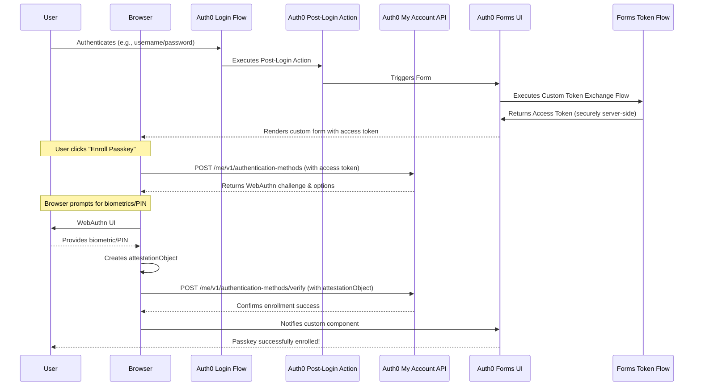

# Custom Passkey Enrollment in Auth0

This document provides a comprehensive, step-by-step walkthrough for implementing a custom passkey enrollment flow using Auth0 Forms, Auth0 Actions, and the Auth0 My Account API. This solution is necessary when you need to trigger passkey enrollment at a specific point in the user's lifecycle, rather than during initial signup. A common use case is giving an authenticated user the option to add additional passkeys to their account.

## Demo


*The complete passkey enrollment flow showing Custom Token Exchange in Auth0 Forms*

## Overview

The standard Auth0 passkey enrollment is designed to trigger in certain ways, such as during the initial sign-up. This solution gives you complete control over when and where the enrollment occurs.

### How It Works

Our custom flow follows these steps:

1. **User Authentication**: A user completes a standard login to your application
2. **Action Trigger**: An Auth0 post-login Action runs, checks a condition (e.g., if the user has enrolled a passkey yet), and triggers a custom Auth0 Form
3. **Token Exchange**: The form uses Custom Token Exchange to get a privileged access token for the My Account API (most secure method as the client secret remains server-side)
4. **Enrollment Initiation**: The form's custom component initiates the passkey enrollment process
5. **Passkey Challenge**: The custom component calls the My Account API to get a passkey challenge
6. **Passkey Creation**: The browser uses the WebAuthn API (`navigator.credentials.create`) to prompt the user to create a passkey
7. **Attestation**: The browser sends the WebAuthn attestationObject back to the custom component
8. **Verification**: The component verifies this attestationObject with the Auth0 My Account API, completing the enrollment

> **Note**: This flow is possible due to the extensibility of Auth0 Forms and Actions, and the new capabilities of the My Account API (currently in Early Access).

## Prerequisites

Before implementing this solution, ensure you have:

- **Auth0 Tenant**: An Auth0 Tenant with a Custom Domain configured. Passkeys are tied to a specific domain, and a custom domain prevents invalidation if the tenant URL changes
- **API Testing Tool**: A Postman account or similar API testing tool
- **Application**: A custom application to host the authentication flow (e.g., a Single-Page Application)
- **API Access**: Your application must be able to securely obtain an access token with the necessary scope for the My Account API

## Implementation Steps Overview

Follow these steps in order to properly set up the Custom Token Exchange flow:

### Step 1: Custom Domain Setup
1. **Configure Custom Domain**: Ensure your Auth0 tenant has a custom domain configured and verified
2. **Update Application URLs**: All callback URLs, logout URLs, and origins must use your custom domain
3. **Test Login Flow**: Verify that users can successfully log in via your custom domain

> **Critical**: All subsequent API calls must use your custom domain, not the tenant URL (e.g., `https://your-domain.com/oauth/token` not `https://tenant.auth0.com/oauth/token`)

### Step 2: Custom Token Exchange Configuration & Testing
1. **Run Postman Collection**: Use the provided Postman collection to configure Custom Token Exchange
2. **Update Postman Variables**: Set `auth0_domain` to your **custom domain** (not tenant URL)
3. **Test Token Exchange Flow**: 
   - Complete all setup requests (1-4)
   - Execute the token exchange test (request 8)
   - Verify you receive a valid access token with the required scopes
4. **Validate Token**: Confirm the returned token has `create:me:authentication_methods` scope

> **Important**: The token exchange endpoint must be called using your custom domain: `https://your-custom-domain.com/oauth/token`

### Step 3: Auth0 Forms Integration
1. **Import Form Configuration**: Use the provided `Auth0 Forms/passkey_enroll_basic.json` to create your Auth0 Form
2. **Update Form Token Exchange**: Ensure the form's Custom Token Exchange flow points to your custom domain
3. **Deploy Action**: Make sure your Custom Token Exchange Action is deployed and active
4. **Test End-to-End Flow**:
   - Trigger the form via your Post-Login Action
   - Monitor Action executions in the Auth0 Dashboard
   - Verify Custom Token Exchange completes successfully
   - Confirm the form receives the access token

### Step 4: Validation & Monitoring
1. **Monitor Executions**: Check Auth0 Dashboard > Actions > Executions for successful token exchanges
2. **Review Logs**: Look for `secte` (successful) or `fecte` (failed) log entries
3. **Test Form Functionality**: Verify the custom component can successfully call the My Account API
4. **End-to-End Testing**: Complete a full passkey enrollment flow

## Additional Enhancements

Once your basic Custom Token Exchange passkey flow is working, you can implement these optional enhancements:

### Enhancement 1: Custom ACUL Flow (Optional)
Create a custom Adaptive Continuous User Login (ACUL) flow to automatically skip Auth0's default built-in passkey enrollment form when users already have passkeys enrolled via your custom flow.

**Benefits:**
- Prevents duplicate enrollment prompts
- Provides seamless user experience
- Maintains consistency with your custom enrollment flow

**Implementation:** [Details to be added]

### Enhancement 2: Application-Level Passkey Management
Add comprehensive passkey management capabilities directly to your application interface.

**Features:**
- **Enroll Button**: Allow users to add additional passkeys from within your app
- **Revoke Button**: Enable users to remove existing passkeys
- **Passkey Viewer**: Display all linked passkeys with device information
- **Management Dashboard**: Comprehensive view of user's authentication methods

**Implementation:** [Details to be added]

## Auth0 Dashboard Configuration

Before writing any code, we need to set up our Auth0 tenant.

### Enable Passkeys for Connection

This is the connection where Auth0 will store the passkey credentials.

1. In the Auth0 Dashboard, go to **Authentication > Database**
2. Select a database connection (or create a new one)
3. Go to the **Authentication Methods** tab and enable the **Passkeys** toggle

### Create a Custom Auth0 Form

This form implements the complete Custom Token Exchange and passkey enrollment flow. The provided form includes both the token exchange logic and the user interface.

#### Form Architecture

The form consists of two main components:

**1. Custom Token Exchange Flow (`cte_flow`)**
- Executes an HTTP request to your custom domain's `/oauth/token` endpoint
- Uses the `urn:ietf:params:oauth:grant-type:token-exchange` grant type
- Exchanges the user's ID (`{{context.user.user_id}}`) for a My Account API access token
- Stores the resulting access token in a shared variable (`my_account_access_token`)

**2. Passkey Enrollment Step (`step_tc2E`)**
- Displays Auth0 branding and user-friendly messaging
- Contains a sophisticated custom component that handles the complete passkey flow
- Uses the access token from the previous step to call the My Account API

#### Custom Component Features

The JavaScript component provides:

- **WebAuthn Integration**: Handles `navigator.credentials.create()` for passkey generation
- **My Account API Communication**: Initiates passkey challenges and verifies attestations
- **User Experience**: Progressive UI with status messages and button states
- **Error Handling**: Comprehensive error management with user-friendly messages
- **Security Features**: Optional duplicate passkey prevention and auto-proceed functionality
- **Responsive Design**: Modern CSS with animations and Auth0 design system integration

#### Configuration Parameters

The form uses these dynamic parameters:
- `email`: User's email from `{{context.user.email}}`
- `clientId`: Your application's client ID
- `auth0Domain`: Your custom domain (critical for proper token exchange)
- `myAccountAt`: Access token from the CTE flow (`{{vars.my_account_access_token}}`)
- `connectionName`: Database connection with passkeys enabled

#### Setup Instructions

1. Go to **Branding > Forms > Library**
2. Select **Create Form** and choose **"Blank Form"**
3. Import the provided JSON configuration from `Auth0 Forms/passkey_enroll_basic.json`
4. **Critical**: Update the following values in the form configuration:
   - Replace `CUSTOM_DOMAIN` with your actual custom domain
   - Replace `TOKEN_EXCHANGE_CLIENT_ID` with your application's client ID
   - Replace `TOKEN_EXCHANGE_CLIENT_SECRET` with your application's client secret
   - Update `connectionName` in the component params
5. Deploy the form and note its Form ID for use in your Post-Login Action

> **Important**: The form's CTE flow **must** use your custom domain endpoint, not the tenant URL, for the token exchange to work properly.

### Configure the Application with My Account API Scopes

Your application will need an access token that allows it to interact with the My Account API on behalf of the user.

1. In the Auth0 Dashboard, go to **Applications > APIs**
2. Find the **MyAccount API** and ensure it is activated
3. Go to **Applications > Applications** and select the application where you will be using this flow
4. In the application settings, go to the **APIs** tab
5. Find the **MyAccount API**, enable it, and grant your application the `create:me:authentication_methods` scope

> **Important**: This is a crucial step to allow the creation of new passkeys.

## Auth0 Actions: The Trigger

This Action serves as the trigger to determine when to show the passkey enrollment form. It runs in the post-login flow and performs a simple check.

### Setup Steps

1. In the Auth0 Dashboard, go to **Actions > Flows**
2. Select the **Login** flow
3. Add an Action to the flow. Name it `trigger-passkey-form`
4. In the code editor, implement the logic to decide when to render the form

### Action Code

The `api.prompt.render()` method is used to show a form to the user:

```javascript
/**
 * Handler that will be called during the execution of a PostLogin flow.
 *
 * @param {Event} event - Details about the user and the context in which they are logging in.
 * @param {api} api - Interface whose methods can be used to change the behavior of the flow.
 */
exports.onExecutePostLogin = async (event, api) => {
  // Check if the user has already enrolled a passkey.
  // This is a simplified check. You may use user_metadata or other logic.
  const hasPasskey = event.user.authenticationMethods.some(
    (method) => method.type === 'passkey'
  );

  if (!hasPasskey) {
    // The Action's only job is to render the form, which will handle its own token exchange.
    // Replace 'FORM_ID' with the actual ID of the custom form you created.
    api.prompt.render('FORM_ID');
  }
};
```


## The Custom Form Component: The Brain of the Operation

The custom form component is where the real magic happens. This sophisticated JavaScript component handles the complete passkey enrollment flow, from WebAuthn API calls to My Account API communication.

### Component Architecture

The `PasskeyRegistrationField` function implements a complete custom field component with the following key sections:

#### Configuration & Testing Options
```javascript
// Testing configuration for development vs production
const ALLOW_DUPLICATE_PASSKEYS = false;  // Prevent duplicate passkeys in production
const ALLOW_AUTO_PROCEED = true;         // Auto-proceed after successful registration
```

#### Core Functionality Areas

**1. WebAuthn Data Conversion**
- `arrayBufferToBase64Url()` - Converts binary data to base64url format
- `base64UrlToArrayBuffer()` - Converts base64url back to binary for WebAuthn API
- Essential for proper data formatting between browser and Auth0 APIs

**2. User Interface Management**
- Dynamic message display with error/success states
- Progressive button state management (register → continue)
- SVG icon integration for visual feedback
- Responsive UI that adapts to enrollment flow state

**3. Passkey Registration Process (`handleRegisterPasskey`)**
The main workflow consists of four critical steps:

**Step 1: Challenge Request**
```javascript
// Request passkey challenge from My Account API
const challengeResponse = await fetch(`https://${auth0Domain}/me/v1/authentication-methods`, {
    method: 'POST',
    headers: {'Authorization': `Bearer ${myAccountAt}`},
    body: JSON.stringify({ type: 'passkey' })
});
```

**Step 2: WebAuthn Options Preparation**
- Converts base64url challenge data to ArrayBuffers
- Configures authenticator selection criteria
- Sets up exclude credentials for duplicate prevention
- Prepares complete `publicKeyCredentialCreationOptions`

**Step 3: Browser WebAuthn API Call**
```javascript
// Browser prompts user for biometric/PIN authentication
const credential = await navigator.credentials.create({ 
    publicKey: publicKeyCredentialCreationOptions 
});
```

**Step 4: Verification with Auth0**
```javascript
// Verify the attestation with Auth0's My Account API
const verifyResponse = await fetch(`https://${auth0Domain}/me/v1/authentication-methods/passkey|new/verify`, {
    method: 'POST',
    headers: {'Authorization': `Bearer ${myAccountAt}`},
    body: JSON.stringify({ auth_session, authn_response })
});
```

#### Advanced Features

**Error Handling & User Experience**
- Comprehensive error handling for different WebAuthn failure scenarios
- User-friendly error messages with appropriate recovery actions
- Special handling for `NotAllowedError` (user cancellation)

**Security Features**
- Optional duplicate passkey prevention using `excludeCredentials`
- Secure token handling and validation
- ID token parsing and user context management

**UI State Management**
- Progressive disclosure (show continue button only after success)
- Button state management (disable during operations)
- Auto-proceed functionality for streamlined UX

**Auth0 Integration**
- Custom field component interface implementation
- Parameter validation and error handling
- Form flow control (`context.form.goForward()`)
- Hidden field management for user tracking

### Key Advantages

1. **Complete Control**: Full control over the enrollment UX and flow
2. **Security**: Uses Auth0's secure My Account API with proper token validation
3. **Flexibility**: Configurable for testing vs production environments
4. **User Experience**: Progressive UI with clear feedback and error handling
5. **Integration**: Seamlessly integrates with Auth0 Forms and Actions

> **Implementation**: The complete source code is embedded in the form configuration at `Auth0 Forms/passkey_enroll_basic.json`.

## Postman Collection for Testing

This collection includes requests for both **Custom Token Exchange setup/testing** and **My Account API testing** for the complete passkey enrollment flow.

> **Resource**: The full Postman collection is provided in a separate file named `postman_collection.json`.

### Custom Token Exchange Requests

These requests are essential for configuring and testing the Custom Token Exchange flow that enables secure token acquisition in Auth0 Forms.

#### Setup & Configuration

**1. Get Management API Token**
- **Method**: `POST`
- **URL**: `https://{{YOUR_AUTH0_DOMAIN}}/oauth/token`
- **Headers**: `Content-Type: application/x-www-form-urlencoded`
- **Body**:
  ```
  grant_type=client_credentials
  client_id={{MANAGEMENT_API_CLIENT_ID}}
  client_secret={{MANAGEMENT_API_CLIENT_SECRET}}
  audience=https://{{YOUR_AUTH0_DOMAIN}}/api/v2/
  ```

**2. Enable Custom Token Exchange on Application**
- **Method**: `PATCH`
- **URL**: `https://{{YOUR_AUTH0_DOMAIN}}/api/v2/clients/{{CLIENT_ID}}`
- **Headers**: 
  - `Content-Type: application/json`
  - `Authorization: Bearer {{MANAGEMENT_API_TOKEN}}`
- **Body**:
  ```json
  {
    "token_exchange": {
      "allow_any_profile_of_type": ["custom_authentication"]
    }
  }
  ```

**3. Get Action ID**
- **Method**: `GET`
- **URL**: `https://{{YOUR_AUTH0_DOMAIN}}/api/v2/actions/actions?actionName={{ACTION_NAME}}`
- **Headers**: `Authorization: Bearer {{MANAGEMENT_API_TOKEN}}`

**4. Create Custom Token Exchange Profile**
- **Method**: `POST`
- **URL**: `https://{{YOUR_AUTH0_DOMAIN}}/api/v2/token-exchange-profiles`
- **Headers**:
  - `Content-Type: application/json`
  - `Authorization: Bearer {{MANAGEMENT_API_TOKEN}}`
- **Body**:
  ```json
  {
    "name": "passkey-form-token-exchange",
    "subject_token_type": "urn:auth0:form:token-exchange",
    "action_id": "{{ACTION_ID}}",
    "type": "custom_authentication"
  }
  ```

#### Profile Management

**5. Get All Token Exchange Profiles**
- **Method**: `GET`
- **URL**: `https://{{YOUR_AUTH0_DOMAIN}}/api/v2/token-exchange-profiles`
- **Headers**: `Authorization: Bearer {{MANAGEMENT_API_TOKEN}}`

**6. Update Token Exchange Profile**
- **Method**: `PATCH`
- **URL**: `https://{{YOUR_AUTH0_DOMAIN}}/api/v2/token-exchange-profiles/{{PROFILE_ID}}`
- **Headers**:
  - `Content-Type: application/json`
  - `Authorization: Bearer {{MANAGEMENT_API_TOKEN}}`
- **Body**:
  ```json
  {
    "name": "updated-profile-name",
    "subject_token_type": "urn:auth0:form:updated-token-exchange"
  }
  ```

**7. Delete Token Exchange Profile**
- **Method**: `DELETE`
- **URL**: `https://{{YOUR_AUTH0_DOMAIN}}/api/v2/token-exchange-profiles/{{PROFILE_ID}}`
- **Headers**: `Authorization: Bearer {{MANAGEMENT_API_TOKEN}}`

#### Testing Token Exchange

**8. Custom Token Exchange Request**
- **Method**: `POST`
- **URL**: `https://{{YOUR_AUTH0_DOMAIN}}/oauth/token`
- **Headers**: `Content-Type: application/x-www-form-urlencoded`
- **Body**:
  ```
  grant_type=urn:ietf:params:oauth:grant-type:token-exchange
  audience={{API_IDENTIFIER}}
  scope=openid create:me:authentication_methods
  subject_token_type=urn:auth0:form:token-exchange
  subject_token={{SUBJECT_TOKEN}}
  client_id={{CLIENT_ID}}
  client_secret={{CLIENT_SECRET}}
  ```

**9. Attack Protection - Get Settings**
- **Method**: `GET`
- **URL**: `https://{{YOUR_AUTH0_DOMAIN}}/api/v2/attack-protection/suspicious-ip-throttling`
- **Headers**: `Authorization: Bearer {{MANAGEMENT_API_TOKEN}}`

**10. Attack Protection - Update Settings**
- **Method**: `PATCH`
- **URL**: `https://{{YOUR_AUTH0_DOMAIN}}/api/v2/attack-protection/suspicious-ip-throttling`
- **Headers**:
  - `Content-Type: application/json`
  - `Authorization: Bearer {{MANAGEMENT_API_TOKEN}}`
- **Body**:
  ```json
  {
    "stage": {
      "pre-custom-token-exchange": {
        "max_attempts": 10,
        "rate": 600000
      }
    }
  }
  ```

### My Account API Requests

These requests test the actual passkey enrollment functionality using tokens obtained from Custom Token Exchange.

**11. Initiate Passkey Enrollment**

Simulate the custom component's call to get the WebAuthn challenge.

- **Method**: `POST`
- **URL**: `https://{{YOUR_AUTH0_DOMAIN}}/api/v2/me/v1/authentication-methods`
- **Headers**:
  - `Content-Type: application/json`
  - `Authorization: Bearer {{access_token}}`
- **Body** (raw JSON):
  ```json
  {
    "type": "passkey",
    "connection": "{{DATABASE_CONNECTION_NAME}}"
  }
  ```

> **Note**: The `access_token` must have the `create:me:authentication_methods` scope.

**12. Verify Passkey Enrollment**

Simulate the custom component's call to verify the passkey. You must get the attestationObject from a real WebAuthn ceremony first.

- **Method**: `POST`
- **URL**: `https://{{YOUR_AUTH0_DOMAIN}}/api/v2/me/v1/authentication-methods/passkey|new/verify`
- **Headers**:
  - `Content-Type: application/json`
  - `Authorization: Bearer {{access_token}}`
- **Body** (raw JSON):
  ```json
  {
    "attestationObject": "BASE64_URL_ENCODED_ATTESTATION_OBJECT",
    "clientDataJSON": "BASE64_URL_ENCODED_CLIENT_DATA",
    "id": "BASE64_URL_ENCODED_CREDENTIAL_ID",
    "rawId": "BASE64_URL_ENCODED_RAW_ID",
    "type": "public-key"
  }
  ```

### Environment Variables

The collection requires these environment variables:

- `YOUR_AUTH0_DOMAIN` - Your Auth0 tenant domain
- `MANAGEMENT_API_CLIENT_ID` - Management API application client ID  
- `MANAGEMENT_API_CLIENT_SECRET` - Management API application client secret
- `CLIENT_ID` - Application client ID for token exchange
- `CLIENT_SECRET` - Application client secret for token exchange
- `API_IDENTIFIER` - Your API identifier/audience
- `DATABASE_CONNECTION_NAME` - Database connection name with passkeys enabled
- `ACTION_ID` - Custom Token Exchange Action ID
- `PROFILE_ID` - Token Exchange Profile ID (after creation)

## Sequence Diagram

This diagram visualizes the complete flow, from login to passkey enrollment:



---

## Files in This Repository

- `Auth0 Forms/passkey_enroll_basic.json` - Full JSON export for the Auth0 Form implementation
- `form_component.js` - Complete custom component code for the Auth0 Form
- `postman_collection.json` - Postman collection for testing the My Account API endpoints