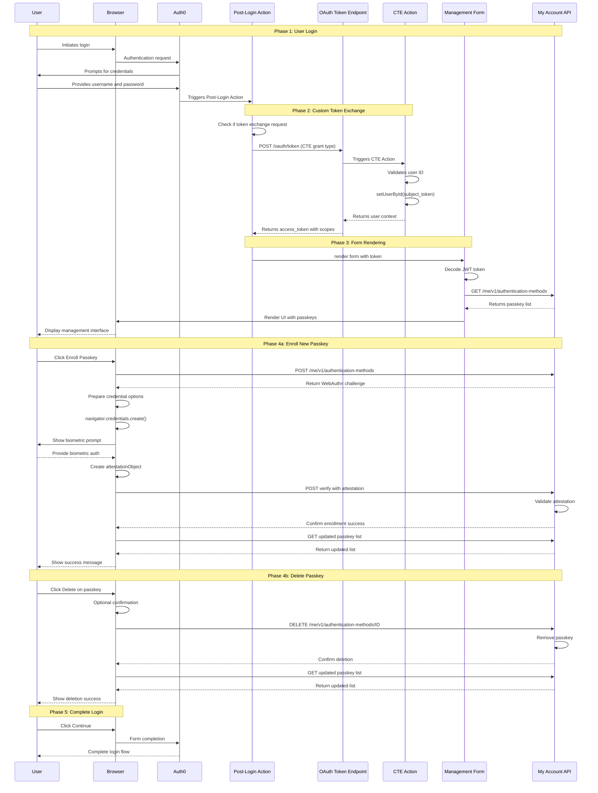

# Custom Passkey Management in Auth0

This document provides a comprehensive, step-by-step walkthrough for implementing a complete custom passkey management solution using Auth0 Forms, Auth0 Actions, and the Auth0 My Account API. This solution enables full passkey lifecycle management including enrollment, viewing, and deletion of passkeys at any point in the user's journey.

> **Note**: This is a streamlined repository focusing on the complete management form implementation. Previous versions included separate sample applications which have been consolidated into this unified approach.

## 🚀 Try It Out

**[Live Demo →](https://passkey-demo-awhit.nodequickstart.oktademo.app/)**

Experience the complete passkey management flow in action. The demo showcases enrollment, viewing existing passkeys, and deletion capabilities.

## Demo


*The complete passkey management flow showing Custom Token Exchange in Auth0 Forms*

## Prerequisites

Before implementing this solution, ensure you have:

- **Auth0 Tenant**: An Auth0 Tenant with a Custom Domain configured. Passkeys are tied to a specific domain, and a custom domain prevents invalidation if the tenant URL changes
- **Node.js & npm**: For running any optional local development tools
- **API Testing Tool**: Postman or similar for testing token exchange flows
- **Database Connection**: An Auth0 database connection with passkeys enabled
- **Basic Knowledge**:
  - Familiarity with Auth0 Actions, Forms, and the My Account API
  - Understanding of ACUL (Adaptive Continuous User Login) - see [Auth0 Universal Login Documentation](https://github.com/auth0/universal-login/tree/master) for comprehensive ACUL guides and examples

## Overview

The standard Auth0 passkey enrollment is designed to trigger in specific ways, such as during initial sign-up. This solution gives you complete control over when and where passkey management occurs, providing users with full control over their authentication methods.

### Solution Components Summary

This solution consists of three core components that work together:

| Component | Type | Purpose | When It Runs |
|-----------|------|---------|--------------|
| **Custom Token Exchange Action** | Auth0 Action (CTE Trigger) | Validates token exchange requests and sets user context | During token exchange requests |
| **Post-Login Action** | Auth0 Action (Login Trigger) | Obtains My Account API token and renders form | Every user login |
| **Passkey Management Form** | Auth0 Form | Provides UI for viewing, enrolling, and deleting passkeys | When rendered by Post-Login Action |

> **Note**: This solution can be combined with ACUL (Adaptive Continuous User Login) for additional enrollment flows. See the [Auth0 Universal Login Repository](https://github.com/auth0/universal-login/tree/master) for ACUL implementation guides and examples.

### How Components Interact

```
┌─────────────────────────────────────────────────────────────────────┐
│                         USER LOGS IN                                 │
└─────────────────┬───────────────────────────────────────────────────┘
                  │
                  ▼
┌─────────────────────────────────────────────────────────────────────┐
│  POST-LOGIN ACTION                                                   │
│  • Checks if this is a token exchange (loop prevention)             │
│  • Validates environment configuration                               │
│  • Calls OAuth token endpoint with CTE grant                         │
└─────────────────┬───────────────────────────────────────────────────┘
                  │
                  │ POST /oauth/token
                  │ grant_type: token-exchange
                  │ subject_token: user_id
                  ▼
┌─────────────────────────────────────────────────────────────────────┐
│  OAUTH TOKEN ENDPOINT                                                │
│  • Receives token exchange request                                   │
│  • Triggers Custom Token Exchange Action                             │
└─────────────────┬───────────────────────────────────────────────────┘
                  │
                  ▼
┌─────────────────────────────────────────────────────────────────────┐
│  CUSTOM TOKEN EXCHANGE ACTION                                        │
│  • Validates subject_token (user ID)                                 │
│  • Calls api.authentication.setUserById(subject_token)              │
│  • Returns control to OAuth endpoint                                 │
└─────────────────┬───────────────────────────────────────────────────┘
                  │
                  │ Returns access_token
                  │ with My Account API scopes
                  ▼
┌─────────────────────────────────────────────────────────────────────┐
│  POST-LOGIN ACTION (continued)                                       │
│  • Receives access_token                                             │
│  • Calls api.prompt.render(FORM_ID, { vars: { api_token } })       │
└─────────────────┬───────────────────────────────────────────────────┘
                  │
                  ▼
┌─────────────────────────────────────────────────────────────────────┐
│  PASSKEY MANAGEMENT FORM                                             │
│  • Receives {{vars.api_token}} from Action                          │
│  • Decodes token to get user info                                    │
│  • Lists existing passkeys (GET /me/v1/authentication-methods)      │
│  • User can:                                                         │
│    - Enroll new passkeys (POST + WebAuthn + POST verify)           │
│    - Delete existing passkeys (DELETE)                               │
│  • Uses token for all My Account API calls                          │
└─────────────────┬───────────────────────────────────────────────────┘
                  │
                  ▼
         USER COMPLETES FORM
       LOGIN FLOW CONTINUES
```

### Architecture Components

This solution consists of four distinct, interconnected components:

#### 1. Custom Token Exchange (CTE) Setup
**Purpose**: Enables secure server-side token exchange for obtaining My Account API access tokens

**What it does**:
- Defines a Custom Token Exchange Action that validates and processes token exchange requests
- Configures your Auth0 application to allow token exchange
- Creates a token exchange profile that links the Action to the exchange flow

**Key Configuration**:
- Subject token type: `urn:cteforms` (identifies the token exchange type)
- Audience: My Account API (`https://YOUR_DOMAIN/me/`)
- Scopes: `read:me:authentication_methods`, `create:me:authentication_methods`, `delete:me:authentication_methods`

#### 2. Post-Login Action (Token Acquisition & Form Trigger)
**Purpose**: Executes on every login to obtain a My Account API token and render the management form

**What it does**:
1. Performs Custom Token Exchange using the user's ID as the subject token
2. Requests a token with the My Account API audience and full management scopes
3. Receives the access token from the token exchange
4. Passes the token to the form via `api.prompt.render()` with variables
5. Handles errors and validates the token exchange succeeded

**Critical Flow**: `User Login → Action → Token Exchange → Form Rendering (with token)`

#### 3. Passkey Management Form
**Purpose**: Provides the user interface and logic for complete passkey lifecycle management

**What it does**:
1. **Token Decoding**: Receives the access token from the Action and decodes it
2. **List Passkeys**: Calls My Account API to fetch all existing passkeys
3. **Display Interface**: Shows passkeys with device info and management options
4. **Enrollment**: Handles WebAuthn credential creation flow when user adds a passkey
5. **Deletion**: Removes passkeys when user deletes them
6. **Error Handling**: Manages API errors and WebAuthn failures gracefully

**Custom Components**: Embedded JavaScript components handle WebAuthn API calls, token management, and My Account API communication

#### 4. ACUL Custom Theme (Optional Enhancement)
**Purpose**: Provides a branded passkey enrollment screen that skips Auth0's default enrollment prompt

**What it does**:
- Displays a custom-branded enrollment screen during ACUL flows
- Detects if users already have passkeys enrolled
- Automatically skips enrollment prompts for users with existing passkeys
- Provides consistent branding with your custom form

**When to use**: If you want to control the ACUL enrollment experience and prevent duplicate prompts for users who already manage passkeys via your custom form

### APIs Used

This solution interacts with the following Auth0 APIs:

#### 1. OAuth Token Endpoint
- **Endpoint**: `POST https://YOUR_CUSTOM_DOMAIN/oauth/token`
- **Purpose**: Performs Custom Token Exchange
- **Grant Type**: `urn:ietf:params:oauth:grant-type:token-exchange`
- **Used By**: Post-Login Action

#### 2. My Account API - Authentication Methods
All endpoints require Bearer token authentication with appropriate scopes:

- **List Authentication Methods**
  - `GET https://YOUR_CUSTOM_DOMAIN/me/v1/authentication-methods`
  - Scope: `read:me:authentication_methods`
  - Returns: Array of all authentication methods including passkeys

- **Initiate Passkey Enrollment**
  - `POST https://YOUR_CUSTOM_DOMAIN/me/v1/authentication-methods`
  - Scope: `create:me:authentication_methods`
  - Body: `{ "type": "passkey", "connection": "CONNECTION_NAME" }`
  - Returns: WebAuthn challenge and credential creation options

- **Verify Passkey Enrollment**
  - `POST https://YOUR_CUSTOM_DOMAIN/me/v1/authentication-methods/passkey|new/verify`
  - Scope: `create:me:authentication_methods`
  - Body: WebAuthn attestation response
  - Returns: Confirmation of successful enrollment

- **Delete Authentication Method**
  - `DELETE https://YOUR_CUSTOM_DOMAIN/me/v1/authentication-methods/{AUTHENTICATOR_ID}`
  - Scope: `delete:me:authentication_methods`
  - Returns: Confirmation of deletion

#### 3. Management API (Setup Only)
- **Endpoint**: `https://YOUR_CUSTOM_DOMAIN/api/v2/*`
- **Purpose**: Configure CTE profiles and application settings
- **Used By**: Initial setup via Postman collection

## Implementation Steps Overview

Follow these steps in order to implement the complete passkey management solution:

### Step 1: Prerequisites & Custom Domain
**Required before starting:**
1. **Custom Domain**: Configure and verify a custom domain in your Auth0 tenant
   - Why: Passkeys are bound to domains; custom domain prevents invalidation
   - Configure at: **Settings > Custom Domains**
2. **Database Connection**: Enable passkeys on a database connection
   - Navigate to: **Authentication > Database > [Your Connection] > Authentication Methods**
   - Toggle: **Passkeys** ON
3. **Application**: Create or identify the application that will use passkey management
4. **My Account API**: Enable and configure scopes on your application
   - Navigate to: **Applications > [Your App] > APIs**
   - Find: **My Account API**
   - Enable scopes: `read:me:authentication_methods`, `create:me:authentication_methods`, `delete:me:authentication_methods`

> **Critical**: All subsequent configuration must use your custom domain, not the tenant URL.

### Step 2: Deploy Custom Token Exchange Action
**Component**: `Auth0 Actions/custom-token-exchange-basic-example.js`

1. **Create Action**:
   - **Actions > Library** → **Create Action** → **Build from Scratch**
   - Name: `Custom Token Exchange - Passkey Management`
   - Trigger: **Custom Token Exchange**
2. **Add Code**: Copy from `custom-token-exchange-basic-example.js`
3. **Deploy**: Click **Deploy**
4. **Note Action ID**: You'll need this for the Postman collection

**What this does**: Validates token exchange requests and establishes user context

### Step 3: Configure Token Exchange Profile (via Postman)
**Component**: `Postman/passkey-forms-demo-collection.json`

1. **Import Collection**: Import the Postman collection
2. **Configure Environment Variables**:
   - `YOUR_AUTH0_DOMAIN`: Your custom domain
   - `MANAGEMENT_API_CLIENT_ID` & `SECRET`: For Management API access
   - `CLIENT_ID` & `CLIENT_SECRET`: Your application credentials
   - `ACTION_NAME`: Name of your CTE Action from Step 2
3. **Run Setup Requests** (in order):
   - Request 1: Get Management API Token
   - Request 2: Enable CTE on Application
   - Request 3: Get Action ID
   - Request 4: Create Token Exchange Profile
4. **Test Token Exchange**:
   - Request 8: Test Custom Token Exchange
   - Verify: Returns `access_token` with all three scopes

**What this does**: Links your CTE Action to the token exchange flow and enables your application to use it

### Step 4: Deploy Post-Login Action
**Component**: `Auth0 Actions/post-login-trigger-get-token-and-render-form.js`

1. **Create Action**:
   - **Actions > Library** → **Create Action**
   - Name: `Post-Login - Passkey Management Form`
   - Trigger: **Login / Post Login**
2. **Add Code**: Copy from `post-login-trigger-get-token-and-render-form.js`
3. **Add Dependencies**: Add `axios` module
4. **Configure Secrets**:
   - `CTE_CLIENT_ID`: Your application client ID
   - `CTE_CLIENT_SECRET`: Your application client secret
   - `MY_ACCOUNT_API_AUDIENCE_CUSTOM_DOMAIN`: `https://YOUR_CUSTOM_DOMAIN/me/`
   - `AUTH0_CUSTOM_DOMAIN`: `YOUR_CUSTOM_DOMAIN` (no https://)
5. **Update Form ID**: Line 108 - replace with your form ID (from Step 5)
6. **Deploy Action**
7. **Add to Login Flow**: **Actions > Flows > Login** → Drag action into flow

**What this does**: Performs token exchange on login and passes token to form

### Step 5: Deploy Passkey Management Form
**Component**: `Auth0 Forms/passkey_manager_demo.json`

1. **Import Form**:
   - **Branding > Forms > Library** → **Create Form** → **Import**
   - Select `passkey_manager_demo.json`
2. **Review Configuration**: Verify custom domain references
3. **Deploy Form**
4. **Copy Form ID**: Note the Form ID for use in Post-Login Action (Step 4, line 108)

**What this does**: Provides the UI and logic for passkey management operations

### Step 6: End-to-End Testing
1. **Login Test**: Log in to your application
2. **Form Display**: Verify the passkey management form appears
3. **List Test**: Confirm existing passkeys display (or "No passkeys" message)
4. **Enroll Test**: Click "Enroll Passkey" and complete WebAuthn flow
5. **Delete Test**: Delete a passkey and verify it's removed
6. **Monitor**: Check **Actions > Executions** for any errors

### Step 7 (Optional): ACUL Integration
**Component**: `ACUL/passkey-enrollment-skip-example/` (optional enhancement)

If you want to integrate this solution with ACUL (Adaptive Continuous User Login), refer to the comprehensive guides and examples in the [Auth0 Universal Login Repository](https://github.com/auth0/universal-login/tree/master).

**What ACUL adds**: Additional enrollment prompts and flows that complement the passkey management form

## Optional Enhancement: ACUL Integration

This solution can be combined with **ACUL (Adaptive Continuous User Login)** to provide additional enrollment prompts and flows.

### ACUL Custom Themes

This repository includes example ACUL custom theme files in `ACUL/passkey-enrollment-skip-example/`:
- `passkey-enrollment-theme.js` - Custom enrollment screen component
- `passkey-enrollment-theme.css` - Theme styles

### Learn More About ACUL

For comprehensive ACUL documentation, implementation guides, and examples:

**📚 [Auth0 Universal Login Repository](https://github.com/auth0/universal-login/tree/master)**

The Universal Login repository provides:
- Complete ACUL implementation guides
- Custom theme examples
- Best practices for enrollment flows
- Integration patterns with passkey management

Refer to that repository for detailed ACUL setup instructions and advanced customization options.

## Auth0 Dashboard Configuration

Before writing any code, we need to set up our Auth0 tenant.

### Enable Passkeys for Connection

This is the connection where Auth0 will store the passkey credentials.

1. In the Auth0 Dashboard, go to **Authentication > Database**
2. Select a database connection (or create a new one)
3. Go to the **Authentication Methods** tab and enable the **Passkeys** toggle

## Implementation: Passkey Management Form

**File**: `Auth0 Forms/passkey_manager_demo.json`

This form provides the complete user interface and logic for passkey lifecycle management. It receives the access token from the Post-Login Action and uses it to interact with the My Account API.

### How the Form Receives the Token

The Post-Login Action passes the token when rendering the form:

```javascript
// In the Post-Login Action:
api.prompt.render('FORM_ID', {
  vars: {
    api_token: myAccountToken  // Token with management scopes
  }
});
```

The form accesses this token internally as `{{vars.api_token}}` and uses it for all My Account API calls.

### Form Architecture & Flow

**1. Token Decoding & Validation**
- **Step 1**: Form receives `{{vars.api_token}}` from Action
- **Step 2**: Decodes the JWT token to extract user information
- **Step 3**: Validates token structure and handles decoding errors
- **Step 4**: Stores decoded user data for display

**2. List Existing Passkeys**
- **API Call**: `GET /me/v1/authentication-methods`
- **Headers**: `Authorization: Bearer {{vars.api_token}}`
- **Returns**: Array of all authentication methods
- **Filtering**: Extracts only passkey-type methods
- **Display**: Shows each passkey with:
  - Authenticator ID
  - Device name/type
  - Created date
  - Delete button

**3. Enroll New Passkey**

When user clicks "Enroll Passkey":

- **Step 1**: `POST /me/v1/authentication-methods`
  - Body: `{ type: "passkey", connection: "CONNECTION_NAME" }`
  - Returns: WebAuthn challenge and credential creation options

- **Step 2**: Prepare WebAuthn options
  - Convert base64url challenge to ArrayBuffer
  - Configure authenticator selection criteria
  - Set relying party (RP) information

- **Step 3**: Call WebAuthn API
  ```javascript
  const credential = await navigator.credentials.create({
    publicKey: publicKeyCredentialCreationOptions
  });
  ```
  - Browser shows biometric/PIN prompt
  - User authenticates
  - Browser returns attestationObject

- **Step 4**: Verify with Auth0
  - `POST /me/v1/authentication-methods/passkey|new/verify`
  - Body: attestationObject, clientDataJSON, credential ID
  - Returns: Confirmation of successful enrollment

- **Step 5**: Refresh passkey list
  - Call `GET /me/v1/authentication-methods` again
  - Update UI to show new passkey

**4. Delete Existing Passkey**

When user clicks "Delete" on a passkey:

- **Step 1**: Confirmation (optional)
  - Show confirmation dialog
  - User confirms deletion intent

- **Step 2**: API call
  - `DELETE /me/v1/authentication-methods/{authenticator_id}`
  - Returns: 204 No Content on success

- **Step 3**: Refresh passkey list
  - Call `GET /me/v1/authentication-methods` again
  - Update UI to remove deleted passkey

**5. Error Handling**
- **API Errors**: Displays user-friendly messages for API failures
- **WebAuthn Errors**: Handles user cancellation and authenticator failures
- **Token Errors**: Shows clear message if token is invalid or missing
- **Network Errors**: Graceful handling of connectivity issues

### Custom Components (Embedded in Form)

The form includes custom JavaScript components that handle:

**WebAuthn Integration**:
- Data conversion between ArrayBuffer and base64url
- Credential creation options preparation
- Browser API interactions
- Attestation response formatting

**My Account API Client**:
- HTTP request handling with proper authentication
- Response parsing and error handling
- Token injection in Authorization headers
- Endpoint URL construction with custom domain

**UI State Management**:
- Loading states during API calls
- Success/error message display
- Button enable/disable states
- Dynamic list updates after operations

**User Experience Features**:
- Progressive disclosure (show relevant options based on state)
- Real-time feedback during operations
- Clear success/error messaging
- Responsive design for all screen sizes

### Setup Instructions

1. **Import Form**:
   - Go to **Branding > Forms > Library** in Auth0 Dashboard
   - Click **Create Form**
   - Select **"Blank Form"**
   - Click **Import** and select `Auth0 Forms/passkey_manager_demo.json`
   - Click **Save**

2. **Configure Form** (if needed):
   - Review the form structure in the visual editor
   - Ensure the custom domain is referenced correctly in any hardcoded URLs
   - Verify the token variable name matches what your Action sends: `{{vars.api_token}}`

3. **Deploy Form**:
   - Click **Deploy** in the form editor
   - Copy the Form ID (shown in the URL or form details)
   - Example Form ID: `ap_joHLLXmZZhDZksdHZwDxMW`

4. **Update Post-Login Action**:
   - Open your Post-Login Action
   - Update line 108 with your Form ID:
     ```javascript
     api.prompt.render('YOUR_FORM_ID_HERE', {
       vars: {
         api_token: myAccountToken
       }
     });
     ```
   - Redeploy the Action

### Form Variables Reference

| Variable | Source | Purpose |
|----------|--------|---------|
| `{{vars.api_token}}` | Post-Login Action | Access token for My Account API calls |
| `{{context.user.user_id}}` | Auth0 Context | User ID for display |
| `{{context.user.email}}` | Auth0 Context | User email for display |

### Critical Requirements

✅ **Token Must Have All Scopes**:
- `read:me:authentication_methods` - Required to list passkeys
- `create:me:authentication_methods` - Required to enroll new passkeys
- `delete:me:authentication_methods` - Required to delete passkeys

❌ **Without proper scopes**, the form will display API errors when trying to perform operations.

✅ **Custom Domain Required**:
- All My Account API calls must use your custom domain
- The form constructs URLs like: `https://{{YOUR_CUSTOM_DOMAIN}}/me/v1/authentication-methods`

❌ **Using tenant domain** (e.g., `tenant.auth0.com`) will cause passkey invalidation if tenant URL changes.

### Testing the Form

1. **Test Token Reception**:
   - Add a test step in the form that displays token presence
   - Verify token is not undefined/null
   - Check token format (should be JWT: three parts separated by dots)

2. **Test List Operation**:
   - Form should call GET endpoint on load
   - Should display "No passkeys" or show existing passkeys
   - Check browser console for API errors

3. **Test Enrollment**:
   - Click "Enroll Passkey" button
   - Verify WebAuthn prompt appears
   - Complete authentication
   - Verify new passkey appears in list

4. **Test Deletion**:
   - Click "Delete" on an existing passkey
   - Verify passkey is removed from list
   - Verify API call succeeds (check network tab)

> **Debugging Tip**: Open browser Developer Tools (F12) → Network tab to see all API calls the form makes. Look for calls to `/me/v1/authentication-methods` and check their status codes and responses.

### Configure the Application with My Account API Scopes

Your application will need an access token that allows it to perform full passkey management operations via the My Account API on behalf of the user.

1. In the Auth0 Dashboard, go to **Applications > APIs**
2. Find the **MyAccount API** and ensure it is activated
3. Go to **Applications > Applications** and select the application where you will be using this flow
4. In the application settings, go to the **APIs** tab
5. Find the **MyAccount API**, enable it, and grant your application the following scopes:
   - `read:me:authentication_methods` - View existing passkeys
   - `create:me:authentication_methods` - Enroll new passkeys
   - `delete:me:authentication_methods` - Delete existing passkeys

> **Important**: All three scopes are required for complete passkey management functionality. Without these scopes, the form will not be able to perform management operations.

## Implementation: Auth0 Actions

Two distinct Actions work together to enable the Custom Token Exchange flow:

### Action 1: Custom Token Exchange Action (CTE Handler)

**File**: `Auth0 Actions/custom-token-exchange-basic-example.js`

**Trigger Type**: `Custom Token Exchange`

**When it runs**: Every time a Custom Token Exchange request is made

**What it does**:
1. Receives the token exchange request from the OAuth endpoint
2. Extracts the `subject_token` (user ID) from the request
3. Calls `api.authentication.setUserById()` to validate and set the user context
4. Returns control to the OAuth endpoint to complete the exchange

**Code**:
```javascript
/**
 * Custom Token Exchange Action
 * Validates token exchange requests and sets user context
 */
exports.onExecuteCustomTokenExchange = async (event, api) => {
  // The subject_token contains the user ID passed from the Post-Login Action
  // This validates that the user exists and sets the context for the token
  api.authentication.setUserById(event.transaction.subject_token);

  return;
};
```

**Setup Steps**:
1. Go to **Actions > Library** in the Auth0 Dashboard
2. Click **Create Action** → **Build from Scratch**
3. **Name**: `Custom Token Exchange - Passkey Management`
4. **Trigger**: Select **Custom Token Exchange**
5. Paste the code from `custom-token-exchange-basic-example.js`
6. Click **Deploy**
7. **Important**: Note the Action ID (needed for creating the token exchange profile in Postman)

**Key Points**:
- This Action is **not** added to any flow manually
- It's automatically triggered when the token exchange profile is configured
- It must be deployed before creating the token exchange profile
- It validates the subject token and establishes user context

---

### Action 2: Post-Login Action (Token Acquisition & Form Renderer)

**File**: `Auth0 Actions/post-login-trigger-get-token-and-render-form.js`

**Trigger Type**: `Post-Login`

**When it runs**: Every time a user completes authentication

**What it does**:
1. **Skip Check**: Verifies this isn't a token exchange request (prevents infinite loops)
2. **Environment Validation**: Checks all required secrets are configured correctly
3. **Token Exchange**: Calls the OAuth token endpoint with Custom Token Exchange grant type
4. **Token Acquisition**: Receives an access token with My Account API scopes
5. **Form Rendering**: Passes the token to the management form via `api.prompt.render()`
6. **Error Handling**: Denies access if token exchange fails

**Token Exchange Details**:
```javascript
// What the Action sends to the OAuth endpoint:
{
  grant_type: 'urn:ietf:params:oauth:grant-type:token-exchange',
  client_id: event.secrets.CTE_CLIENT_ID,
  client_secret: event.secrets.CTE_CLIENT_SECRET,
  audience: event.secrets.MY_ACCOUNT_API_AUDIENCE_CUSTOM_DOMAIN, // https://auth.custom.com/me/
  scope: 'read:me:authentication_methods create:me:authentication_methods delete:me:authentication_methods',
  subject_token: event.user.user_id, // The user who just logged in
  subject_token_type: 'urn:cteforms'
}

// What it receives back:
{
  access_token: 'eyJhbGciOiJSUzI1NiIsInR5cCI6IkpXVCJ9...',
  token_type: 'Bearer',
  scope: 'read:me:authentication_methods create:me:authentication_methods delete:me:authentication_methods'
}
```

**Setup Steps**:

1. **Create Action**:
   - Go to **Actions > Library**
   - Click **Create Action** → **Build from Scratch**
   - **Name**: `Post-Login - Passkey Management Form`
   - **Trigger**: Select **Login / Post Login**
   - Paste the code from `post-login-trigger-get-token-and-render-form.js`

2. **Add Dependencies**:
   - Click **Dependencies** (package icon)
   - Add module: `axios` (latest version)

3. **Configure Secrets**:
   Click **Secrets** (key icon) and add:

   | Secret Name | Value | Example |
   |-------------|-------|---------|
   | `CTE_CLIENT_ID` | Client ID of your application | `a1b2c3d4e5f6g7h8` |
   | `CTE_CLIENT_SECRET` | Client secret of your application | `secret_abc123...` |
   | `MY_ACCOUNT_API_AUDIENCE_CUSTOM_DOMAIN` | My Account API audience (full URL) | `https://auth.custom.com/me/` |
   | `AUTH0_CUSTOM_DOMAIN` | Your custom domain (bare domain, no https://) | `auth.custom.com` |

4. **Update Form ID**:
   - Find line 108: `api.prompt.render('ap_joHLLXmZZhDZksdHZwDxMW', {`
   - Replace `ap_joHLLXmZZhDZksdHZwDxMW` with your actual Form ID
   - You'll get the Form ID after deploying your form

5. **Deploy Action**:
   - Click **Deploy**

6. **Add to Login Flow**:
   - Go to **Actions > Flows**
   - Select **Login**
   - Drag your Action from the right sidebar into the flow
   - Click **Apply**

**Critical Configuration Notes**:

- **Custom Domain**: Must be configured and used for all URLs
  - ❌ Wrong: `AUTH0_CUSTOM_DOMAIN: https://auth.custom.com` (includes protocol)
  - ✅ Right: `AUTH0_CUSTOM_DOMAIN: auth.custom.com` (bare domain)
  - ❌ Wrong: `MY_ACCOUNT_API_AUDIENCE_CUSTOM_DOMAIN: https://tenant.auth0.com/me/` (tenant URL)
  - ✅ Right: `MY_ACCOUNT_API_AUDIENCE_CUSTOM_DOMAIN: https://auth.custom.com/me/` (custom domain)

- **Subject Token Type**: Must match your token exchange profile
  - The Action uses: `subject_token_type: 'urn:cteforms'`
  - Your token exchange profile must use: `subject_token_type: 'urn:cteforms'`
  - These **must** match exactly

- **Loop Prevention**: The Action checks `event.transaction.protocol !== "oauth2-token-exchange"`
  - This prevents the Action from running during token exchange
  - Without this check, you'd get infinite loops

**What the Form Receives**:

The form receives the token via the `vars` object:
```javascript
api.prompt.render('FORM_ID', {
  vars: {
    api_token: myAccountToken  // Access token with all management scopes
  }
});
```

The form can then access this as `{{vars.api_token}}` in its configuration.

---

### Why Both Actions Are Required

| Action | Purpose | Runs When | Result |
|--------|---------|-----------|--------|
| **Custom Token Exchange Action** | Validates the token exchange request and sets user context | OAuth endpoint processes token exchange | User context established for token |
| **Post-Login Action** | Obtains the token and delivers it to the form | User completes login | Form receives token and can call My Account API |

**The Flow**:
```
User Logs In
    ↓
Post-Login Action Runs
    ↓
Action calls OAuth /token endpoint (token exchange)
    ↓
OAuth endpoint triggers CTE Action
    ↓
CTE Action validates user and returns
    ↓
OAuth endpoint returns access token
    ↓
Post-Login Action receives token
    ↓
Post-Login Action renders form with token
    ↓
Form uses token to call My Account API
```

> **Important**: The form **cannot** function without the token from the Post-Login Action. There is no "simpler" implementation - both Actions are required for this architecture to work.


## Form Components Overview

The passkey management form (`passkey_manager_demo.json`) contains sophisticated custom components that handle the complete passkey lifecycle. These components are embedded directly in the form JSON and work together to provide a seamless management experience.

### Key Component Capabilities

**WebAuthn Integration**
- Handles `navigator.credentials.create()` for passkey enrollment
- Converts between binary data formats (ArrayBuffer) and base64url for API communication
- Manages WebAuthn credential options and authenticator selection

**My Account API Communication**
- **Read Operations**: Fetch and display all existing passkeys for the user
- **Create Operations**: Initiate passkey challenges and verify attestations
- **Delete Operations**: Remove specific passkeys from the user's account
- Secure token handling with proper authorization headers

**User Interface Management**
- Dynamic display of existing passkeys with device information
- Progressive UI states (loading, success, error)
- Button state management during operations
- Real-time updates after create/delete operations

**Error Handling**
- Comprehensive error handling for WebAuthn failures
- User-friendly error messages
- Graceful degradation when operations fail
- Special handling for user cancellations

**Passkey Enrollment Workflow**

When a user enrolls a new passkey, the component follows these steps:

1. **Challenge Request**: POST to `/me/v1/authentication-methods` with `type: 'passkey'`
2. **WebAuthn Call**: Browser prompts for biometric/PIN using `navigator.credentials.create()`
3. **Attestation**: Capture the WebAuthn attestationObject from the browser
4. **Verification**: POST attestation to `/me/v1/authentication-methods/passkey|new/verify`
5. **Confirmation**: Display success message and refresh passkey list

**Passkey Deletion Workflow**

When a user deletes an existing passkey:

1. **User Selection**: User clicks delete on a specific passkey
2. **Confirmation**: (Optional) Confirm deletion intent
3. **API Call**: DELETE to `/me/v1/authentication-methods/{authenticator_id}`
4. **Update UI**: Remove passkey from display and show confirmation

### Key Advantages

1. **Complete Lifecycle Management**: Full CRUD operations for passkeys
2. **Security**: Uses Auth0's secure My Account API with proper scoped tokens
3. **User Experience**: Intuitive UI with clear feedback and error handling
4. **Integration**: Seamlessly integrates with Auth0 Forms and Actions
5. **Extensibility**: Easy to customize and extend with additional features

> **Implementation**: All component logic is embedded in the form configuration at `Auth0 Forms/passkey_manager_demo.json`. You can customize the components by editing the form in the Auth0 Dashboard after importing.

## Postman Collection for Testing

The Postman collection provides all the API calls needed to set up and test this solution. It's organized into two main categories.

> **Resource**: The full Postman collection is provided at `Postman/passkey-forms-demo-collection.json`.

> **Important Note**: The Postman collection may contain placeholder values like `urn:auth0:form:token-exchange` for the `subject_token_type`. You must update this to match the value used in your Post-Login Action (`urn:cteforms` in the provided Action code). The `subject_token_type` in the token exchange profile, the token exchange request, and the Post-Login Action **must all match exactly**.

### Collection Organization

#### Part 1: One-Time Setup (Management API)

These requests configure Custom Token Exchange in your Auth0 tenant. Run these once during initial setup.

**1. Get Management API Token**
- **Endpoint**: `POST /oauth/token`
- **Purpose**: Obtain a token to call Management API
- **Required Variables**: `MANAGEMENT_API_CLIENT_ID`, `MANAGEMENT_API_CLIENT_SECRET`

**2. Enable Custom Token Exchange on Application**
- **Endpoint**: `PATCH /api/v2/clients/{{CLIENT_ID}}`
- **Purpose**: Allow your application to use Custom Token Exchange
- **Sets**: `token_exchange.allow_any_profile_of_type: ["custom_authentication"]`

**3. Get Action ID**
- **Endpoint**: `GET /api/v2/actions/actions?actionName={{ACTION_NAME}}`
- **Purpose**: Retrieve the ID of your deployed Custom Token Exchange Action
- **Returns**: Action ID needed for profile creation

**4. Create Custom Token Exchange Profile**
- **Endpoint**: `POST /api/v2/token-exchange-profiles`
- **Purpose**: Create the profile linking your Action to the token exchange flow
- **Configuration**:
  ```json
  {
    "name": "passkey-management-token-exchange",
    "subject_token_type": "urn:cteforms",
    "action_id": "{{ACTION_ID}}",
    "type": "custom_authentication"
  }
  ```
- **Important**: The `subject_token_type` value (`urn:cteforms`) **must match exactly** what the Post-Login Action uses. If you change it, update both the profile and the Action.

**5. Get All Token Exchange Profiles**
- **Endpoint**: `GET /api/v2/token-exchange-profiles`
- **Purpose**: View all configured token exchange profiles

**6. Update Token Exchange Profile** (Optional)
- **Endpoint**: `PATCH /api/v2/token-exchange-profiles/{{PROFILE_ID}}`
- **Purpose**: Modify an existing profile

**7. Delete Token Exchange Profile** (Optional)
- **Endpoint**: `DELETE /api/v2/token-exchange-profiles/{{PROFILE_ID}}`
- **Purpose**: Remove a profile during troubleshooting or cleanup

#### Part 2: Testing Custom Token Exchange

**8. Test Custom Token Exchange**
- **Endpoint**: `POST /oauth/token`
- **Purpose**: Verify that Custom Token Exchange is working correctly
- **Grant Type**: `urn:ietf:params:oauth:grant-type:token-exchange`
- **Critical Parameters**:
  - `audience`: `https://{{YOUR_CUSTOM_DOMAIN}}/me/` (My Account API)
  - `scope`: `read:me:authentication_methods create:me:authentication_methods delete:me:authentication_methods`
  - `subject_token_type`: `urn:cteforms`
  - `subject_token`: A valid user ID (e.g., `auth0|123456`)
- **Success**: Returns `access_token` with requested scopes
- **Use**: This simulates what the Post-Login Action does at runtime

#### Part 3: Testing My Account API Operations

These requests simulate what the form does at runtime using the token from Custom Token Exchange.

**9. List Authentication Methods**
- **Endpoint**: `GET /me/v1/authentication-methods`
- **Purpose**: Retrieve all passkeys for a user
- **Required Scope**: `read:me:authentication_methods`
- **Returns**: Array of authentication methods including passkey details
- **Use**: Test that you can read the user's passkeys

**10. Initiate Passkey Enrollment**
- **Endpoint**: `POST /me/v1/authentication-methods`
- **Purpose**: Start the passkey enrollment process
- **Required Scope**: `create:me:authentication_methods`
- **Body**: `{ "type": "passkey", "connection": "{{DATABASE_CONNECTION_NAME}}" }`
- **Returns**: WebAuthn challenge and credential creation options
- **Use**: Test that enrollment initiation works

**11. Verify Passkey Enrollment**
- **Endpoint**: `POST /me/v1/authentication-methods/passkey|new/verify`
- **Purpose**: Complete passkey enrollment with WebAuthn attestation
- **Required Scope**: `create:me:authentication_methods`
- **Body**: WebAuthn attestation response (from browser's `navigator.credentials.create()`)
- **Returns**: Confirmation of successful enrollment
- **Note**: You need a real WebAuthn attestation from a browser to test this

**12. Delete Authentication Method**
- **Endpoint**: `DELETE /me/v1/authentication-methods/{{AUTHENTICATOR_ID}}`
- **Purpose**: Remove a passkey from the user's account
- **Required Scope**: `delete:me:authentication_methods`
- **Returns**: 204 No Content on success
- **Use**: Test that you can delete passkeys

### Required Environment Variables

Configure these variables in your Postman environment:

**Setup Variables:**
- `YOUR_AUTH0_DOMAIN` - Your custom Auth0 domain (e.g., `auth.example.com`)
- `MANAGEMENT_API_CLIENT_ID` - Client ID of your Management API application
- `MANAGEMENT_API_CLIENT_SECRET` - Client secret of your Management API application
- `CLIENT_ID` - Client ID of the application using Custom Token Exchange
- `CLIENT_SECRET` - Client secret of the application using Custom Token Exchange
- `ACTION_NAME` - Name of your Custom Token Exchange Action (to lookup ID)

**Runtime Variables:**
- `DATABASE_CONNECTION_NAME` - Name of your database connection with passkeys enabled
- `SUBJECT_TOKEN` - A test user ID for token exchange testing (e.g., `auth0|123456`)

**Auto-Generated Variables** (saved by requests):
- `MANAGEMENT_API_TOKEN` - Token for Management API calls (from request 1)
- `ACTION_ID` - ID of your CTE Action (from request 3)
- `PROFILE_ID` - ID of your token exchange profile (from request 4)
- `access_token` - My Account API token (from request 8)
- `AUTHENTICATOR_ID` - ID of a passkey to delete (from request 9)

### Testing Workflow

1. **Initial Setup** (one-time):
   - Run requests 1-4 in order
   - Save the `PROFILE_ID` from request 4

2. **Verify CTE Works**:
   - Run request 8 with a real user ID as `SUBJECT_TOKEN`
   - Verify you receive an `access_token`
   - Check the token includes all three scopes

3. **Test My Account API**:
   - Run request 9 to list passkeys (should work even if empty)
   - Run request 10 to initiate enrollment (will return WebAuthn challenge)
   - Run request 12 to delete a passkey (need a real `AUTHENTICATOR_ID` from request 9)

4. **Troubleshooting**:
   - Use request 5 to view your token exchange profiles
   - Use request 7 to delete and recreate profiles if needed

## Complete Architecture Flow

### Sequence Diagram: Full Token Exchange and Management Flow

This diagram shows all components and their interactions from login through passkey management:



### Key Flow Details

**Token Exchange Request (Phase 2)**:
```
POST /oauth/token
{
  grant_type: "urn:ietf:params:oauth:grant-type:token-exchange",
  subject_token: "auth0|user123",
  subject_token_type: "urn:cteforms",
  audience: "https://custom-domain.com/me/",
  scope: "read:me:authentication_methods create:me:authentication_methods delete:me:authentication_methods",
  client_id: "...",
  client_secret: "..."
}
```

**Form Token Variable (Phase 3)**:
```javascript
api.prompt.render('FORM_ID', {
  vars: {
    api_token: access_token
  }
});
```

### ACUL Integration (Optional)

This solution can be extended with ACUL (Adaptive Continuous User Login) for additional enrollment prompts. For ACUL implementation details, custom themes, and integration examples, refer to the [Auth0 Universal Login Repository](https://github.com/auth0/universal-login/tree/master).

---

## Troubleshooting

### Common Issues and Solutions

#### Issue: "Token exchange failed" in Post-Login Action logs

**Possible Causes**:
1. Token exchange profile not created or misconfigured
2. CTE Action not deployed
3. Wrong subject_token_type (must match profile)
4. Application not enabled for CTE

**Solutions**:
- Run Postman requests 5 to verify profile exists
- Check that `subject_token_type` in profile matches Action (`urn:cteforms`)
- Verify CTE Action is deployed (not just saved)
- Confirm application has `token_exchange.allow_any_profile_of_type: ["custom_authentication"]`

#### Issue: Form displays "Token not found" or "Undefined token"

**Possible Causes**:
1. Post-Login Action not passing token to form
2. Variable name mismatch
3. Token exchange failed silently

**Solutions**:
- Check Post-Login Action logs for token exchange success
- Verify Action uses: `api.prompt.render(FORM_ID, { vars: { api_token: token } })`
- Verify Form accesses: `{{vars.api_token}}`
- Add logging in Action to confirm token is received

#### Issue: "403 Forbidden" when calling My Account API

**Possible Causes**:
1. Token missing required scopes
2. Token expired
3. Wrong audience in token

**Solutions**:
- Check token scopes in Post-Login Action logs
- Verify token exchange requests all three scopes: `read:me:authentication_methods create:me:authentication_methods delete:me:authentication_methods`
- Confirm audience is `https://YOUR_CUSTOM_DOMAIN/me/` (note the trailing slash)
- Check token at jwt.io to verify scopes and audience

#### Issue: "Invalid custom domain" errors

**Possible Causes**:
1. Using tenant URL instead of custom domain
2. Custom domain not verified
3. Hardcoded tenant URLs in form/action

**Solutions**:
- Verify custom domain is verified: **Settings > Custom Domains**
- Update all URLs to use custom domain (Actions, form, Postman)
- Search for `auth0.com` in Action code and replace with custom domain
- Ensure `AUTH0_CUSTOM_DOMAIN` secret has NO `https://` prefix

#### Issue: WebAuthn prompt never appears

**Possible Causes**:
1. Challenge request failed
2. Browser doesn't support WebAuthn
3. JavaScript error in form component

**Solutions**:
- Open browser DevTools (F12) → Console tab, look for errors
- Check Network tab for `/me/v1/authentication-methods` POST request
- Verify browser supports WebAuthn: check `window.PublicKeyCredential`
- Test on different browser (Chrome, Safari, Edge all support WebAuthn)
- Ensure page is served over HTTPS (WebAuthn requires secure context)

#### Issue: Infinite loop / Action keeps running

**Possible Causes**:
1. Missing loop prevention check in Post-Login Action
2. Token exchange triggering Post-Login flow again

**Solutions**:
- Verify Post-Login Action has: `if (event.transaction.protocol === "oauth2-token-exchange") return;`
- This check should be at the very beginning of the Action
- Check Action logs for repeated executions with same user ID

#### Issue: "Action timeout" errors

**Possible Causes**:
1. Token exchange endpoint not responding
2. Network issues
3. Invalid custom domain configuration

**Solutions**:
- Test token exchange directly via Postman (Request 8)
- Verify custom domain DNS is correctly configured
- Check if tenant has rate limiting enabled
- Reduce timeout in Action if needed (but fix root cause first)

### Debugging Checklist

When things aren't working, check these in order:

- [ ] Custom domain is verified and active
- [ ] Database connection has passkeys enabled
- [ ] Application has My Account API scopes enabled
- [ ] CTE Action is deployed (not just saved)
- [ ] Token exchange profile is created (Postman Request 5)
- [ ] Post-Login Action has correct secrets configured
- [ ] Post-Login Action has loop prevention check
- [ ] Post-Login Action has correct Form ID
- [ ] Form is deployed (not just saved)
- [ ] Application credentials match between Action secrets and Postman
- [ ] All URLs use custom domain (no `tenant.auth0.com` references)
- [ ] Token exchange test works in Postman (Request 8)

### Viewing Logs

**Action Logs**:
- **Dashboard > Monitoring > Logs**
- Filter by Action name
- Look for `secte` (successful token exchange) or `fecte` (failed)

**Action Executions**:
- **Dashboard > Actions > Executions**
- Shows real-time Action execution with details
- Click execution to see full logs and context

**Browser Console**:
- Press **F12** → **Console** tab
- See client-side JavaScript errors from form
- Check **Network** tab for API call failures

---

## Repository Structure

### Auth0 Forms
```
Auth0 Forms/
└── passkey_manager_demo.json
    Complete passkey management form with embedded components
    - Token decoding logic
    - Passkey listing UI
    - WebAuthn enrollment flow
    - Passkey deletion logic
    - Error handling
```

### Auth0 Actions
```
Auth0 Actions/
├── custom-token-exchange-basic-example.js
│   CTE Action: Validates token exchange requests
│   Trigger: Custom Token Exchange
│   Purpose: Set user context for token
│
└── post-login-trigger-get-token-and-render-form.js
    Post-Login Action: Gets token and renders form
    Trigger: Login / Post Login
    Purpose: Token acquisition and form delivery
    Dependencies: axios
    Secrets: CTE_CLIENT_ID, CTE_CLIENT_SECRET,
             MY_ACCOUNT_API_AUDIENCE_CUSTOM_DOMAIN,
             AUTH0_CUSTOM_DOMAIN
```

### ACUL Enhancement (Optional)
```
ACUL/passkey-enrollment-skip-example/
├── passkey-enrollment-theme.js
│   Example custom ACUL theme (React bundle)
│
└── passkey-enrollment-theme.css
    Example ACUL theme styles

For ACUL implementation guides, see:
https://github.com/auth0/universal-login/tree/master
```

### Testing & Resources
```
Postman/
└── passkey-forms-demo-collection.json
    Complete API test collection
    - Management API setup (Requests 1-7)
    - Token exchange testing (Request 8)
    - My Account API testing (Requests 9-12)

Example/
└── passkey-walkthrough-fast.gif
    Demo walkthrough animation
```

---

## Additional Resources

### Auth0 Documentation
- [Auth0 Forms Documentation](https://auth0.com/docs/customize/forms)
- [Auth0 Actions Documentation](https://auth0.com/docs/customize/actions)
- [My Account API Documentation](https://auth0.com/docs/api/my-account)
- [Custom Token Exchange Documentation](https://auth0.com/docs/authenticate/custom-token-exchange)

### Web Standards
- [WebAuthn Specification](https://www.w3.org/TR/webauthn-2/)
- [Web Authentication API (MDN)](https://developer.mozilla.org/en-US/docs/Web/API/Web_Authentication_API)

### Additional Learning
- [Passkeys.dev](https://passkeys.dev/) - Comprehensive passkey resources
- [WebAuthn.io](https://webauthn.io/) - Interactive WebAuthn demo

---

## Support

For issues, questions, or contributions:
- **Issues**: Open an issue in this repository
- **Auth0 Support**: Contact Auth0 support for tenant-specific questions
- **Community**: [Auth0 Community](https://community.auth0.com/)

---

## License

This sample code is provided as-is under the MIT License. See LICENSE file for details.