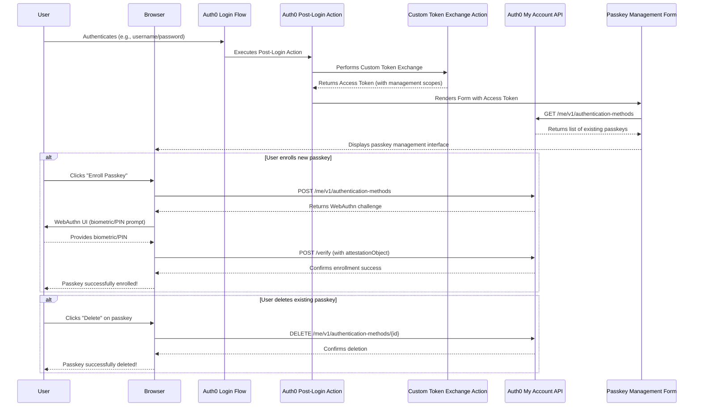

# Custom Passkey Management in Auth0

This document provides a comprehensive, step-by-step walkthrough for implementing a complete custom passkey management solution using Auth0 Forms, Auth0 Actions, and the Auth0 My Account API. This solution enables full passkey lifecycle management including enrollment, viewing, and deletion of passkeys at any point in the user's journey.

> **Note**: This is a streamlined repository focusing on the complete management form implementation. Previous versions included separate sample applications which have been consolidated into this unified approach.

## 🚀 Try It Out

**[Live Demo →](https://passkey-demo-awhit.nodequickstart.oktademo.app/)**

Experience the complete passkey management flow in action. The demo showcases enrollment, viewing existing passkeys, and deletion capabilities.

## Demo


*The complete passkey management flow showing Custom Token Exchange in Auth0 Forms*

## Prerequisites

Before implementing this solution, ensure you have:

- **Auth0 Tenant**: An Auth0 Tenant with a Custom Domain configured. Passkeys are tied to a specific domain, and a custom domain prevents invalidation if the tenant URL changes
- **Node.js & npm**: For running any optional local development tools
- **API Testing Tool**: Postman or similar for testing token exchange flows
- **Database Connection**: An Auth0 database connection with passkeys enabled
- **Basic Knowledge**: Familiarity with Auth0 Actions, Forms, and the My Account API

## Overview

The standard Auth0 passkey enrollment is designed to trigger in specific ways, such as during initial sign-up. This solution gives you complete control over when and where passkey management occurs, providing users with full control over their authentication methods.

### How It Works

Our custom management flow follows these steps:

1. **User Authentication**: A user completes a standard login to your application
2. **Action Trigger**: An Auth0 post-login Action runs and triggers a custom Auth0 Form for passkey management
3. **Token Exchange**: The Action performs Custom Token Exchange to obtain a privileged access token for the My Account API with full management scopes (`read`, `create`, `delete`)
4. **Form Rendering**: The form displays the user's existing passkeys and management options
5. **Management Operations**:
   - **View**: Display all enrolled passkeys with device information
   - **Enroll**: Create new passkeys using WebAuthn API (`navigator.credentials.create`)
   - **Delete**: Remove existing passkeys from the user's account
6. **API Communication**: All operations securely communicate with the Auth0 My Account API using the exchanged token

> **Note**: This flow leverages the extensibility of Auth0 Forms and Actions, combined with the comprehensive capabilities of the My Account API (currently in Early Access).

## Implementation Steps Overview

Follow these steps in order to properly set up the Custom Token Exchange flow:

### Step 1: Custom Domain Setup
1. **Configure Custom Domain**: Ensure your Auth0 tenant has a custom domain configured and verified
2. **Update Application URLs**: All callback URLs, logout URLs, and origins must use your custom domain
3. **Test Login Flow**: Verify that users can successfully log in via your custom domain

> **Critical**: All subsequent API calls must use your custom domain, not the tenant URL (e.g., `https://your-domain.com/oauth/token` not `https://tenant.auth0.com/oauth/token`)

### Step 2: Custom Token Exchange Configuration & Testing
1. **Run Postman Collection**: Use the provided Postman collection to configure Custom Token Exchange
2. **Update Postman Variables**: Set `auth0_domain` to your **custom domain** (not tenant URL)
3. **Test Token Exchange Flow**:
   - Complete all setup requests (1-4)
   - Execute the token exchange test (request 8)
   - Verify you receive a valid access token with the required scopes
4. **Validate Token**: Confirm the returned token has all management scopes: `read:me:authentication_methods`, `create:me:authentication_methods`, and `delete:me:authentication_methods`

> **Important**: The token exchange endpoint must be called using your custom domain: `https://your-custom-domain.com/oauth/token`

### Step 3: Auth0 Forms Integration
1. **Import Form Configuration**: Use the provided `Auth0 Forms/passkey_manager_demo.json` to create your Auth0 Form
2. **Update Form Configuration**: Ensure your custom domain and client credentials are correctly configured
3. **Deploy Actions**: Make sure both your Custom Token Exchange Action and Post-Login Action are deployed and active
4. **Test End-to-End Flow**:
   - Trigger the form via your Post-Login Action
   - Monitor Action executions in the Auth0 Dashboard
   - Verify Custom Token Exchange completes successfully with all required scopes
   - Confirm the form displays existing passkeys and management options

### Step 4: Validation & Monitoring
1. **Monitor Executions**: Check Auth0 Dashboard > Actions > Executions for successful token exchanges
2. **Review Logs**: Look for `secte` (successful) or `fecte` (failed) log entries
3. **Test Form Functionality**: Verify the custom component can successfully call the My Account API
4. **End-to-End Testing**: Complete a full passkey enrollment flow

## Optional Enhancement: Custom ACUL Theme

Once your basic passkey management flow is working, you can implement a custom ACUL (Adaptive Continuous User Login) theme to enhance the passkey enrollment experience.

### What is ACUL?

ACUL is Auth0's built-in adaptive authentication flow that can prompt users to enroll passkeys during login. The custom theme allows you to:
- Create a branded passkey enrollment screen
- Skip Auth0's default enrollment UI when users already have passkeys
- Provide a seamless, on-brand user experience

### Implementation Files

The ACUL custom theme is provided in `ACUL/passkey-enrollment-skip-example/`:

**Files:**
- `passkey-enrollment-theme.js` - Compiled React bundle containing the custom enrollment screen component
- `passkey-enrollment-theme.css` - Minified stylesheet for the enrollment screen

**Features:**
- Custom branded enrollment screen
- Loading states and animations
- Automatic detection of existing passkeys
- Responsive design that matches Auth0's design system

### How to Use

1. **Navigate to Dashboard**: Go to **Branding > Adaptive Continuous User Login (ACUL)** in your Auth0 Dashboard
2. **Enable Custom Theme**: Enable the custom theme option
3. **Upload Files**: Upload both the JavaScript and CSS files from the ACUL directory
4. **Configure Settings**: Set up ACUL to trigger passkey enrollment based on your requirements
5. **Test Flow**: Verify the custom screen appears during login when appropriate

### Benefits

- **Consistency**: Matches your brand and custom form design
- **User Experience**: Smoother transition between enrollment prompts
- **Control**: Full control over when and how enrollment prompts appear
- **Skip Logic**: Automatically skip prompts for users who already have passkeys enrolled

## Auth0 Dashboard Configuration

Before writing any code, we need to set up our Auth0 tenant.

### Enable Passkeys for Connection

This is the connection where Auth0 will store the passkey credentials.

1. In the Auth0 Dashboard, go to **Authentication > Database**
2. Select a database connection (or create a new one)
3. Go to the **Authentication Methods** tab and enable the **Passkeys** toggle

### Create a Custom Auth0 Form

This form implements the complete passkey management solution including token exchange, viewing, enrollment, and deletion capabilities. The provided form (`passkey_manager_demo.json`) includes all the logic and UI components needed for full passkey lifecycle management.

#### Form Architecture

The form consists of multiple components working together:

**1. Token Decoding Flow**
- Decodes JWT tokens to extract user information
- Validates token structure and handles errors gracefully
- Stores decoded user data for form components

**2. Passkey Management Interface**
- Lists all existing passkeys with device information
- Provides enrollment button for adding new passkeys
- Includes delete functionality for removing passkeys
- Real-time updates after management operations

**3. Custom Components**
- **WebAuthn Integration**: Handles `navigator.credentials.create()` for passkey generation
- **My Account API Communication**: Full CRUD operations (read, create, delete) for passkeys
- **User Experience**: Progressive UI with status messages and button states
- **Error Handling**: Comprehensive error management with user-friendly messages
- **Security Features**: Secure token handling and validation

#### Configuration Parameters

The form receives these parameters from the Post-Login Action:
- `api_token`: Access token obtained via Custom Token Exchange with full management scopes
- User context data extracted from the ID token

#### Setup Instructions

1. Go to **Branding > Forms > Library**
2. Select **Create Form** and choose **"Blank Form"**
3. Import the provided JSON configuration from `Auth0 Forms/passkey_manager_demo.json`
4. **Critical**: Review and update any configuration values:
   - Ensure custom domain references are correct
   - Verify API endpoint URLs match your tenant configuration
5. Deploy the form and note its Form ID for use in your Post-Login Action

> **Important**: The form expects to receive a properly scoped access token from the Action. Ensure your Custom Token Exchange Action requests all necessary scopes: `read:me:authentication_methods`, `create:me:authentication_methods`, and `delete:me:authentication_methods`.

### Configure the Application with My Account API Scopes

Your application will need an access token that allows it to perform full passkey management operations via the My Account API on behalf of the user.

1. In the Auth0 Dashboard, go to **Applications > APIs**
2. Find the **MyAccount API** and ensure it is activated
3. Go to **Applications > Applications** and select the application where you will be using this flow
4. In the application settings, go to the **APIs** tab
5. Find the **MyAccount API**, enable it, and grant your application the following scopes:
   - `read:me:authentication_methods` - View existing passkeys
   - `create:me:authentication_methods` - Enroll new passkeys
   - `delete:me:authentication_methods` - Delete existing passkeys

> **Important**: All three scopes are required for complete passkey management functionality. Without these scopes, the form will not be able to perform management operations.

## Auth0 Actions

This solution requires two types of Actions working together to enable secure passkey management.

### Action 1: Custom Token Exchange Action

This Action handles the token exchange process, validating the request and setting the appropriate user context.

**File**: `Auth0 Actions/custom-token-exchange-basic-example.js`

**Purpose**:
- Validates token exchange requests
- Sets the user ID for the token exchange
- Runs in the Custom Token Exchange flow

**Setup**:
1. Go to **Actions > Library** in the Auth0 Dashboard
2. Create a new Action with **Trigger**: Custom Token Exchange
3. Copy the code from `custom-token-exchange-basic-example.js`
4. Deploy the Action

**Key Code**:
```javascript
exports.onExecuteCustomTokenExchange = async (event, api) => {
  api.authentication.setUserById(event.transaction.subject_token);
  return;
};
```

### Action 2: Post-Login Action (Form Trigger)

This Action triggers the passkey management form and performs the token exchange to obtain the necessary access token.

**File**: `Auth0 Actions/post-login-trigger-get-token-and-render-form.js`

**Purpose**:
- Executes on every user login
- Performs Custom Token Exchange to get My Account API token
- Passes the token to the management form
- Handles errors gracefully

**Features**:
- Environment validation (checks for required secrets)
- Token exchange with full management scopes
- Error handling and logging
- Form rendering with token injection

**Setup**:
1. Go to **Actions > Library** in the Auth0 Dashboard
2. Create a new Action with **Trigger**: Post-Login
3. Copy the code from `post-login-trigger-get-token-and-render-form.js`
4. Add the **axios** dependency
5. Configure the following **Secrets**:
   - `CTE_CLIENT_ID`: Client ID for token exchange
   - `CTE_CLIENT_SECRET`: Client Secret for token exchange
   - `MY_ACCOUNT_API_AUDIENCE_CUSTOM_DOMAIN`: Audience URI (e.g., `https://auth.custom.com/me/`)
   - `AUTH0_CUSTOM_DOMAIN`: Your Auth0 custom domain (e.g., `auth.custom.com`)
6. Update the Form ID in line 108 to match your deployed form
7. Deploy the Action
8. Add it to your **Login** flow

**Important Configuration Notes**:
- The `AUTH0_CUSTOM_DOMAIN` should be the bare domain (no `https://`)
- The Action requests three scopes: `read:me:authentication_methods`, `create:me:authentication_methods`, `delete:me:authentication_methods`
- The Action skips execution for token exchange requests to prevent loops

### Simple Example (Minimal Implementation)

If you prefer a simpler approach without token exchange in the Action, here's a minimal example:

```javascript
/**
 * Minimal Post-Login Action that renders the form
 * Note: This assumes the form handles its own token exchange
 */
exports.onExecutePostLogin = async (event, api) => {
  // Replace 'FORM_ID' with the actual ID of your deployed form
  api.prompt.render('FORM_ID');
};
```

> **Recommended Approach**: Use the full implementation from `post-login-trigger-get-token-and-render-form.js` as it provides better error handling, validation, and security.


## Form Components Overview

The passkey management form (`passkey_manager_demo.json`) contains sophisticated custom components that handle the complete passkey lifecycle. These components are embedded directly in the form JSON and work together to provide a seamless management experience.

### Key Component Capabilities

**WebAuthn Integration**
- Handles `navigator.credentials.create()` for passkey enrollment
- Converts between binary data formats (ArrayBuffer) and base64url for API communication
- Manages WebAuthn credential options and authenticator selection

**My Account API Communication**
- **Read Operations**: Fetch and display all existing passkeys for the user
- **Create Operations**: Initiate passkey challenges and verify attestations
- **Delete Operations**: Remove specific passkeys from the user's account
- Secure token handling with proper authorization headers

**User Interface Management**
- Dynamic display of existing passkeys with device information
- Progressive UI states (loading, success, error)
- Button state management during operations
- Real-time updates after create/delete operations

**Error Handling**
- Comprehensive error handling for WebAuthn failures
- User-friendly error messages
- Graceful degradation when operations fail
- Special handling for user cancellations

**Passkey Enrollment Workflow**

When a user enrolls a new passkey, the component follows these steps:

1. **Challenge Request**: POST to `/me/v1/authentication-methods` with `type: 'passkey'`
2. **WebAuthn Call**: Browser prompts for biometric/PIN using `navigator.credentials.create()`
3. **Attestation**: Capture the WebAuthn attestationObject from the browser
4. **Verification**: POST attestation to `/me/v1/authentication-methods/passkey|new/verify`
5. **Confirmation**: Display success message and refresh passkey list

**Passkey Deletion Workflow**

When a user deletes an existing passkey:

1. **User Selection**: User clicks delete on a specific passkey
2. **Confirmation**: (Optional) Confirm deletion intent
3. **API Call**: DELETE to `/me/v1/authentication-methods/{authenticator_id}`
4. **Update UI**: Remove passkey from display and show confirmation

### Key Advantages

1. **Complete Lifecycle Management**: Full CRUD operations for passkeys
2. **Security**: Uses Auth0's secure My Account API with proper scoped tokens
3. **User Experience**: Intuitive UI with clear feedback and error handling
4. **Integration**: Seamlessly integrates with Auth0 Forms and Actions
5. **Extensibility**: Easy to customize and extend with additional features

> **Implementation**: All component logic is embedded in the form configuration at `Auth0 Forms/passkey_manager_demo.json`. You can customize the components by editing the form in the Auth0 Dashboard after importing.

## Postman Collection for Testing

This collection includes requests for both **Custom Token Exchange setup/testing** and **My Account API testing** for the complete passkey management flow.

> **Resource**: The full Postman collection is provided at `Postman/passkey-forms-demo-collection.json`.

### Custom Token Exchange Requests

These requests are essential for configuring and testing the Custom Token Exchange flow that enables secure token acquisition in Auth0 Forms.

#### Setup & Configuration

**1. Get Management API Token**
- **Method**: `POST`
- **URL**: `https://{{YOUR_AUTH0_DOMAIN}}/oauth/token`
- **Headers**: `Content-Type: application/x-www-form-urlencoded`
- **Body**:
  ```
  grant_type=client_credentials
  client_id={{MANAGEMENT_API_CLIENT_ID}}
  client_secret={{MANAGEMENT_API_CLIENT_SECRET}}
  audience=https://{{YOUR_AUTH0_DOMAIN}}/api/v2/
  ```

**2. Enable Custom Token Exchange on Application**
- **Method**: `PATCH`
- **URL**: `https://{{YOUR_AUTH0_DOMAIN}}/api/v2/clients/{{CLIENT_ID}}`
- **Headers**: 
  - `Content-Type: application/json`
  - `Authorization: Bearer {{MANAGEMENT_API_TOKEN}}`
- **Body**:
  ```json
  {
    "token_exchange": {
      "allow_any_profile_of_type": ["custom_authentication"]
    }
  }
  ```

**3. Get Action ID**
- **Method**: `GET`
- **URL**: `https://{{YOUR_AUTH0_DOMAIN}}/api/v2/actions/actions?actionName={{ACTION_NAME}}`
- **Headers**: `Authorization: Bearer {{MANAGEMENT_API_TOKEN}}`

**4. Create Custom Token Exchange Profile**
- **Method**: `POST`
- **URL**: `https://{{YOUR_AUTH0_DOMAIN}}/api/v2/token-exchange-profiles`
- **Headers**:
  - `Content-Type: application/json`
  - `Authorization: Bearer {{MANAGEMENT_API_TOKEN}}`
- **Body**:
  ```json
  {
    "name": "passkey-form-token-exchange",
    "subject_token_type": "urn:auth0:form:token-exchange",
    "action_id": "{{ACTION_ID}}",
    "type": "custom_authentication"
  }
  ```

#### Profile Management

**5. Get All Token Exchange Profiles**
- **Method**: `GET`
- **URL**: `https://{{YOUR_AUTH0_DOMAIN}}/api/v2/token-exchange-profiles`
- **Headers**: `Authorization: Bearer {{MANAGEMENT_API_TOKEN}}`

**6. Update Token Exchange Profile**
- **Method**: `PATCH`
- **URL**: `https://{{YOUR_AUTH0_DOMAIN}}/api/v2/token-exchange-profiles/{{PROFILE_ID}}`
- **Headers**:
  - `Content-Type: application/json`
  - `Authorization: Bearer {{MANAGEMENT_API_TOKEN}}`
- **Body**:
  ```json
  {
    "name": "updated-profile-name",
    "subject_token_type": "urn:auth0:form:updated-token-exchange"
  }
  ```

**7. Delete Token Exchange Profile**
- **Method**: `DELETE`
- **URL**: `https://{{YOUR_AUTH0_DOMAIN}}/api/v2/token-exchange-profiles/{{PROFILE_ID}}`
- **Headers**: `Authorization: Bearer {{MANAGEMENT_API_TOKEN}}`

#### Testing Token Exchange

**8. Custom Token Exchange Request**
- **Method**: `POST`
- **URL**: `https://{{YOUR_AUTH0_DOMAIN}}/oauth/token`
- **Headers**: `Content-Type: application/x-www-form-urlencoded`
- **Body**:
  ```
  grant_type=urn:ietf:params:oauth:grant-type:token-exchange
  audience={{API_IDENTIFIER}}
  scope=openid read:me:authentication_methods create:me:authentication_methods delete:me:authentication_methods
  subject_token_type=urn:auth0:form:token-exchange
  subject_token={{SUBJECT_TOKEN}}
  client_id={{CLIENT_ID}}
  client_secret={{CLIENT_SECRET}}
  ```

**9. Attack Protection - Get Settings**
- **Method**: `GET`
- **URL**: `https://{{YOUR_AUTH0_DOMAIN}}/api/v2/attack-protection/suspicious-ip-throttling`
- **Headers**: `Authorization: Bearer {{MANAGEMENT_API_TOKEN}}`

**10. Attack Protection - Update Settings**
- **Method**: `PATCH`
- **URL**: `https://{{YOUR_AUTH0_DOMAIN}}/api/v2/attack-protection/suspicious-ip-throttling`
- **Headers**:
  - `Content-Type: application/json`
  - `Authorization: Bearer {{MANAGEMENT_API_TOKEN}}`
- **Body**:
  ```json
  {
    "stage": {
      "pre-custom-token-exchange": {
        "max_attempts": 10,
        "rate": 600000
      }
    }
  }
  ```

### My Account API Requests

These requests test the complete passkey management functionality using tokens obtained from Custom Token Exchange.

**11. List User's Authentication Methods**

Retrieve all authentication methods (including passkeys) for the authenticated user.

- **Method**: `GET`
- **URL**: `https://{{YOUR_AUTH0_DOMAIN}}/me/v1/authentication-methods`
- **Headers**:
  - `Authorization: Bearer {{access_token}}`

> **Note**: The `access_token` must have the `read:me:authentication_methods` scope.

**12. Initiate Passkey Enrollment**

Simulate the custom component's call to get the WebAuthn challenge for enrolling a new passkey.

- **Method**: `POST`
- **URL**: `https://{{YOUR_AUTH0_DOMAIN}}/me/v1/authentication-methods`
- **Headers**:
  - `Content-Type: application/json`
  - `Authorization: Bearer {{access_token}}`
- **Body** (raw JSON):
  ```json
  {
    "type": "passkey",
    "connection": "{{DATABASE_CONNECTION_NAME}}"
  }
  ```

> **Note**: The `access_token` must have the `create:me:authentication_methods` scope.

**13. Verify Passkey Enrollment**

Simulate the custom component's call to verify the passkey. You must get the attestationObject from a real WebAuthn ceremony first.

- **Method**: `POST`
- **URL**: `https://{{YOUR_AUTH0_DOMAIN}}/me/v1/authentication-methods/passkey|new/verify`
- **Headers**:
  - `Content-Type: application/json`
  - `Authorization: Bearer {{access_token}}`
- **Body** (raw JSON):
  ```json
  {
    "attestationObject": "BASE64_URL_ENCODED_ATTESTATION_OBJECT",
    "clientDataJSON": "BASE64_URL_ENCODED_CLIENT_DATA",
    "id": "BASE64_URL_ENCODED_CREDENTIAL_ID",
    "rawId": "BASE64_URL_ENCODED_RAW_ID",
    "type": "public-key"
  }
  ```

**14. Delete Passkey**

Remove a specific passkey from the user's account.

- **Method**: `DELETE`
- **URL**: `https://{{YOUR_AUTH0_DOMAIN}}/me/v1/authentication-methods/{{AUTHENTICATOR_ID}}`
- **Headers**:
  - `Authorization: Bearer {{access_token}}`

> **Note**: The `access_token` must have the `delete:me:authentication_methods` scope. The `AUTHENTICATOR_ID` can be obtained from the List request (request 11).

### Environment Variables

The collection requires these environment variables:

- `YOUR_AUTH0_DOMAIN` - Your Auth0 tenant domain
- `MANAGEMENT_API_CLIENT_ID` - Management API application client ID  
- `MANAGEMENT_API_CLIENT_SECRET` - Management API application client secret
- `CLIENT_ID` - Application client ID for token exchange
- `CLIENT_SECRET` - Application client secret for token exchange
- `API_IDENTIFIER` - Your API identifier/audience
- `DATABASE_CONNECTION_NAME` - Database connection name with passkeys enabled
- `ACTION_ID` - Custom Token Exchange Action ID
- `PROFILE_ID` - Token Exchange Profile ID (after creation)

## Sequence Diagram

This diagram visualizes the complete flow, from login to passkey management:



---

## Files in This Repository

### Auth0 Forms
- `Auth0 Forms/passkey_manager_demo.json` - Complete passkey management form with embedded components

### Auth0 Actions
- `Auth0 Actions/custom-token-exchange-basic-example.js` - Custom Token Exchange Action implementation
- `Auth0 Actions/post-login-trigger-get-token-and-render-form.js` - Post-Login Action with token exchange and form rendering

### ACUL Enhancement (Optional)
- `ACUL/passkey-enrollment-skip-example/passkey-enrollment-theme.js` - Custom ACUL theme (compiled React bundle)
- `ACUL/passkey-enrollment-skip-example/passkey-enrollment-theme.css` - Custom ACUL theme styles

### Testing & Resources
- `Postman/passkey-forms-demo-collection.json` - Postman collection for Custom Token Exchange setup and My Account API testing
- `Example/passkey-walkthrough-fast.gif` - Demo walkthrough animation

---

## Additional Resources

- [Auth0 Forms Documentation](https://auth0.com/docs/customize/forms)
- [Auth0 Actions Documentation](https://auth0.com/docs/customize/actions)
- [My Account API Documentation](https://auth0.com/docs/api/my-account)
- [Custom Token Exchange Documentation](https://auth0.com/docs/authenticate/custom-token-exchange)
- [WebAuthn Specification](https://www.w3.org/TR/webauthn-2/)

---

## Support

For issues, questions, or contributions, please open an issue in this repository or contact Auth0 support.