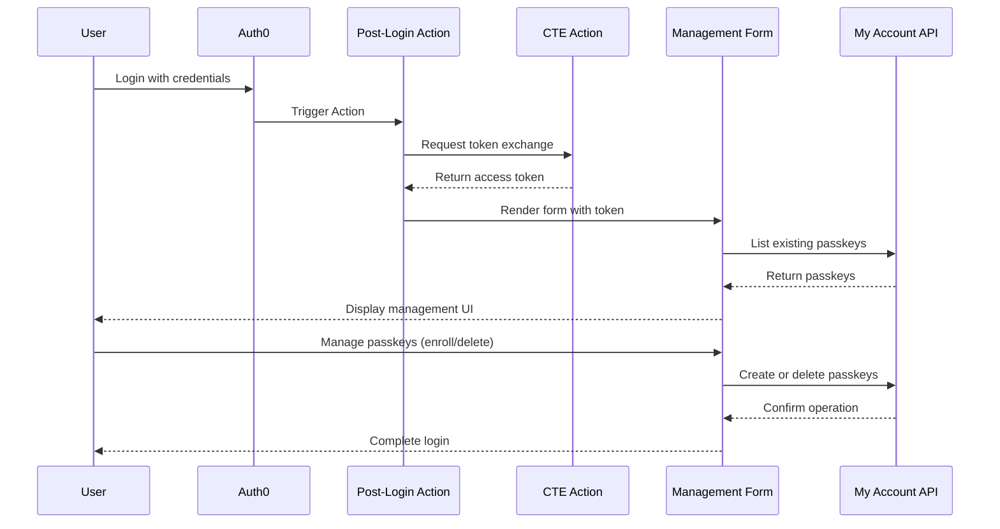

# Custom Passkey Management in Auth0

This document provides a comprehensive, step-by-step walkthrough for implementing a complete custom passkey management solution using Auth0 Forms, Auth0 Actions, and the Auth0 My Account API. This solution enables full passkey lifecycle management including enrollment, viewing, and deletion of passkeys at any point in the user's journey.

> **Note**: This is a streamlined repository focusing on the complete management form implementation. Previous versions included separate sample applications which have been consolidated into this unified approach.

## 🚀 Try It Out

**[Live Demo →](https://passkey-demo-awhit.nodequickstart.oktademo.app/)**

Experience the complete passkey management flow in action. The demo showcases enrollment, viewing existing passkeys, and deletion capabilities.

## Demo


*The complete passkey management flow showing Custom Token Exchange in Auth0 Forms*

## Prerequisites

Before implementing this solution, ensure you have:

- **Auth0 Tenant**: An Auth0 Tenant with a Custom Domain configured. Passkeys are tied to a specific domain, and a custom domain prevents invalidation if the tenant URL changes
- **Node.js & npm**: For running any optional local development tools
- **API Testing Tool**: Postman or similar for testing token exchange flows
- **Database Connection**: An Auth0 database connection with passkeys enabled
- **Basic Knowledge**:
  - Familiarity with Auth0 Actions, Forms, and the My Account API
  - Understanding of ACUL (Adaptive Continuous User Login) - see [Auth0 Universal Login Documentation](https://github.com/auth0/universal-login/tree/master) for comprehensive ACUL guides and examples

## Overview

The standard Auth0 passkey enrollment is designed to trigger in specific ways, such as during initial sign-up. This solution gives you complete control over when and where passkey management occurs, providing users with full control over their authentication methods.

### Solution Components Summary

This solution consists of three core components that work together:

| Component | Type | Purpose | When It Runs |
|-----------|------|---------|--------------|
| **Custom Token Exchange Action** | Auth0 Action (CTE Trigger) | Validates token exchange requests and sets user context | During token exchange requests |
| **Post-Login Action** | Auth0 Action (Login Trigger) | Obtains My Account API token and renders form | Every user login |
| **Passkey Management Form** | Auth0 Form | Provides UI for viewing, enrolling, and deleting passkeys | When rendered by Post-Login Action |

> **Note**: This solution can be combined with ACUL (Adaptive Continuous User Login) for additional enrollment flows. See the [Auth0 Universal Login Repository](https://github.com/auth0/universal-login/tree/master) for ACUL implementation guides and examples.

### How Components Interact

```
┌─────────────────────────────────────────────────────────────────────┐
│                         USER LOGS IN                                 │
└─────────────────┬───────────────────────────────────────────────────┘
                  │
                  ▼
┌─────────────────────────────────────────────────────────────────────┐
│  POST-LOGIN ACTION                                                   │
│  • Checks if this is a token exchange (loop prevention)             │
│  • Validates environment configuration                               │
│  • Calls OAuth token endpoint with CTE grant                         │
└─────────────────┬───────────────────────────────────────────────────┘
                  │
                  │ POST /oauth/token
                  │ grant_type: token-exchange
                  │ subject_token: user_id
                  ▼
┌─────────────────────────────────────────────────────────────────────┐
│  OAUTH TOKEN ENDPOINT                                                │
│  • Receives token exchange request                                   │
│  • Triggers Custom Token Exchange Action                             │
└─────────────────┬───────────────────────────────────────────────────┘
                  │
                  ▼
┌─────────────────────────────────────────────────────────────────────┐
│  CUSTOM TOKEN EXCHANGE ACTION                                        │
│  • Validates subject_token (user ID)                                 │
│  • Calls api.authentication.setUserById(subject_token)              │
│  • Returns control to OAuth endpoint                                 │
└─────────────────┬───────────────────────────────────────────────────┘
                  │
                  │ Returns access_token
                  │ with My Account API scopes
                  ▼
┌─────────────────────────────────────────────────────────────────────┐
│  POST-LOGIN ACTION (continued)                                       │
│  • Receives access_token                                             │
│  • Calls api.prompt.render(FORM_ID, { vars: { api_token } })       │
└─────────────────┬───────────────────────────────────────────────────┘
                  │
                  ▼
┌─────────────────────────────────────────────────────────────────────┐
│  PASSKEY MANAGEMENT FORM                                             │
│  • Receives {{vars.api_token}} from Action                          │
│  • Decodes token to get user info                                    │
│  • Lists existing passkeys (GET /me/v1/authentication-methods)      │
│  • User can:                                                         │
│    - Enroll new passkeys (POST + WebAuthn + POST verify)           │
│    - Delete existing passkeys (DELETE)                               │
│  • Uses token for all My Account API calls                          │
└─────────────────┬───────────────────────────────────────────────────┘
                  │
                  ▼
         USER COMPLETES FORM
       LOGIN FLOW CONTINUES
```

### Architecture Components

**1. Custom Token Exchange (CTE) Action**: Validates token exchange requests and establishes user context for the token.

**2. Post-Login Action**: Performs token exchange to obtain a My Account API access token with management scopes (`read`, `create`, `delete`), then passes it to the form.

**3. Passkey Management Form**: Receives the token and provides UI for listing, enrolling, and deleting passkeys via My Account API calls.

### APIs Used

**OAuth Token Endpoint**: `POST /oauth/token` - Performs Custom Token Exchange (grant type: `token-exchange`)

**My Account API**:
- `GET /me/v1/authentication-methods` - List passkeys (scope: `read:me:authentication_methods`)
- `POST /me/v1/authentication-methods` - Initiate enrollment (scope: `create:me:authentication_methods`)
- `POST /me/v1/authentication-methods/passkey|new/verify` - Verify enrollment (scope: `create:me:authentication_methods`)
- `DELETE /me/v1/authentication-methods/{ID}` - Delete passkey (scope: `delete:me:authentication_methods`)

**Management API**: `https://YOUR_CUSTOM_DOMAIN/api/v2/*` - Used for initial CTE profile setup via Postman

## Implementation Steps

### 1. Configure Prerequisites
- **Custom Domain**: Configure at **Settings > Custom Domains**
- **Database Connection**: Enable passkeys at **Authentication > Database > [Connection] > Authentication Methods**
- **My Account API Scopes**: Go to **Applications > [Your App] > APIs**, enable My Account API with scopes: `read:me:authentication_methods`, `create:me:authentication_methods`, `delete:me:authentication_methods`

### 2. Deploy CTE Action
Create Custom Token Exchange Action from `Auth0 Actions/custom-token-exchange-basic-example.js`. Deploy and note the Action ID.

### 3. Configure Token Exchange Profile
Import `Postman/passkey-forms-demo-collection.json`. Run setup requests 1-4 to create the token exchange profile linking your CTE Action.

### 4. Deploy Post-Login Action
Create Post-Login Action from `Auth0 Actions/post-login-trigger-get-token-and-render-form.js`. Add `axios` dependency, configure secrets, update Form ID (line 108), deploy, and add to Login flow.

### 5. Deploy Management Form
Import `Auth0 Forms/passkey_manager_demo.json`, deploy, and copy Form ID to your Post-Login Action.

### 6. Test
Login and verify form appears, passkeys list, enrollment works, and deletion works. Monitor **Actions > Executions** for errors.

## Optional Enhancement: ACUL Integration

This repository includes example ACUL theme files in `ACUL/passkey-enrollment-skip-example/`. For ACUL implementation guides, see the [Auth0 Universal Login Repository](https://github.com/auth0/universal-login/tree/master).

## Implementation: Auth0 Actions

### Action 1: Custom Token Exchange Action

**File**: `Auth0 Actions/custom-token-exchange-basic-example.js`

Copy the code from `custom-token-exchange-basic-example.js` to a new Custom Token Exchange Action in your Auth0 tenant. This Action validates token exchange requests by extracting the subject token (user ID) and calling `api.authentication.setUserById()` to establish user context. It's automatically triggered when the token exchange profile is configured and must be deployed before creating that profile.

**Setup**:
1. **Actions > Library** → **Create Action** → **Custom Token Exchange**
2. Name: `Custom Token Exchange - Passkey Management`
3. Paste code from file
4. Deploy and note the Action ID

---

### Action 2: Post-Login Action

**File**: `Auth0 Actions/post-login-trigger-get-token-and-render-form.js`

Copy the code from `post-login-trigger-get-token-and-render-form.js` to a new Post-Login Action. This Action performs Custom Token Exchange to obtain a My Account API access token with management scopes, then passes that token to the form via `api.prompt.render()`. It includes loop prevention checks and validates that all required secrets are configured.

**Setup**:
1. **Actions > Library** → **Create Action** → **Login / Post Login**
2. Name: `Post-Login - Passkey Management Form`
3. Paste code from file
4. Add dependency: `axios`
5. Configure Secrets:
   - `CTE_CLIENT_ID` - Your application client ID
   - `CTE_CLIENT_SECRET` - Your application client secret
   - `MY_ACCOUNT_API_AUDIENCE_CUSTOM_DOMAIN` - `https://your-custom-domain.com/me/`
   - `AUTH0_CUSTOM_DOMAIN` - `your-custom-domain.com` (no https://)
6. Update line 108 with your Form ID
7. Deploy
8. **Actions > Flows > Login** → Add Action to flow


## Postman Collection for Testing

**File**: `Postman/passkey-forms-demo-collection.json`

Import the Postman collection to configure and test Custom Token Exchange and My Account API operations.

> **Important**: Update `subject_token_type` to `urn:cteforms` in the collection to match your Post-Login Action.

### Setup Requests (Run Once)
1. Get Management API Token
2. Enable CTE on Application
3. Get Action ID (your deployed CTE Action)
4. Create Token Exchange Profile (links Action to token exchange)

### Testing Requests
5. Test Custom Token Exchange (simulates Post-Login Action)
6. List Authentication Methods (GET passkeys)
7. Initiate Passkey Enrollment (POST challenge)
8. Verify Passkey Enrollment (POST attestation)
9. Delete Authentication Method (DELETE passkey)

**Required Variables**: Set in Postman environment
- `YOUR_AUTH0_DOMAIN` - Your custom domain
- `MANAGEMENT_API_CLIENT_ID` / `SECRET` - Management API credentials
- `CLIENT_ID` / `CLIENT_SECRET` - Application credentials
- `ACTION_NAME` - Your CTE Action name
- `DATABASE_CONNECTION_NAME` - Connection with passkeys enabled
- `SUBJECT_TOKEN` - Test user ID (e.g., `auth0|123456`)

## Complete Architecture Flow

### Sequence Diagram



### Key Components

**Custom Token Exchange**: Post-Login Action requests token with My Account API scopes
```javascript
// Token exchange request
grant_type: "urn:ietf:params:oauth:grant-type:token-exchange"
subject_token: user_id
audience: "https://custom-domain.com/me/"
scope: "read:me:authentication_methods create:me:authentication_methods delete:me:authentication_methods"
```

**Form Token Delivery**: Action passes token to form
```javascript
api.prompt.render('FORM_ID', {
  vars: { api_token: access_token }
});
```

### ACUL Integration (Optional)

This solution can be extended with ACUL (Adaptive Continuous User Login) for additional enrollment prompts. For ACUL implementation details, refer to the [Auth0 Universal Login Repository](https://github.com/auth0/universal-login/tree/master).

---

## Troubleshooting

### Common Issues and Solutions

#### Issue: "Token exchange failed" in Post-Login Action logs

**Possible Causes**:
1. Token exchange profile not created or misconfigured
2. CTE Action not deployed
3. Wrong subject_token_type (must match profile)
4. Application not enabled for CTE

**Solutions**:
- Run Postman requests 5 to verify profile exists
- Check that `subject_token_type` in profile matches Action (`urn:cteforms`)
- Verify CTE Action is deployed (not just saved)
- Confirm application has `token_exchange.allow_any_profile_of_type: ["custom_authentication"]`

#### Issue: Form displays "Token not found" or "Undefined token"

**Possible Causes**:
1. Post-Login Action not passing token to form
2. Variable name mismatch
3. Token exchange failed silently

**Solutions**:
- Check Post-Login Action logs for token exchange success
- Verify Action uses: `api.prompt.render(FORM_ID, { vars: { api_token: token } })`
- Verify Form accesses: `{{vars.api_token}}`
- Add logging in Action to confirm token is received

#### Issue: "403 Forbidden" when calling My Account API

**Possible Causes**:
1. Token missing required scopes
2. Token expired
3. Wrong audience in token

**Solutions**:
- Check token scopes in Post-Login Action logs
- Verify token exchange requests all three scopes: `read:me:authentication_methods create:me:authentication_methods delete:me:authentication_methods`
- Confirm audience is `https://YOUR_CUSTOM_DOMAIN/me/` (note the trailing slash)
- Check token at jwt.io to verify scopes and audience

#### Issue: "Invalid custom domain" errors

**Possible Causes**:
1. Using tenant URL instead of custom domain
2. Custom domain not verified
3. Hardcoded tenant URLs in form/action

**Solutions**:
- Verify custom domain is verified: **Settings > Custom Domains**
- Update all URLs to use custom domain (Actions, form, Postman)
- Search for `auth0.com` in Action code and replace with custom domain
- Ensure `AUTH0_CUSTOM_DOMAIN` secret has NO `https://` prefix

#### Issue: WebAuthn prompt never appears

**Possible Causes**:
1. Challenge request failed
2. Browser doesn't support WebAuthn
3. JavaScript error in form component

**Solutions**:
- Open browser DevTools (F12) → Console tab, look for errors
- Check Network tab for `/me/v1/authentication-methods` POST request
- Verify browser supports WebAuthn: check `window.PublicKeyCredential`
- Test on different browser (Chrome, Safari, Edge all support WebAuthn)
- Ensure page is served over HTTPS (WebAuthn requires secure context)

#### Issue: Infinite loop / Action keeps running

**Possible Causes**:
1. Missing loop prevention check in Post-Login Action
2. Token exchange triggering Post-Login flow again

**Solutions**:
- Verify Post-Login Action has: `if (event.transaction.protocol === "oauth2-token-exchange") return;`
- This check should be at the very beginning of the Action
- Check Action logs for repeated executions with same user ID

#### Issue: "Action timeout" errors

**Possible Causes**:
1. Token exchange endpoint not responding
2. Network issues
3. Invalid custom domain configuration

**Solutions**:
- Test token exchange directly via Postman (Request 8)
- Verify custom domain DNS is correctly configured
- Check if tenant has rate limiting enabled
- Reduce timeout in Action if needed (but fix root cause first)

### Debugging Checklist

When things aren't working, check these in order:

- [ ] Custom domain is verified and active
- [ ] Database connection has passkeys enabled
- [ ] Application has My Account API scopes enabled
- [ ] CTE Action is deployed (not just saved)
- [ ] Token exchange profile is created (Postman Request 5)
- [ ] Post-Login Action has correct secrets configured
- [ ] Post-Login Action has loop prevention check
- [ ] Post-Login Action has correct Form ID
- [ ] Form is deployed (not just saved)
- [ ] Application credentials match between Action secrets and Postman
- [ ] All URLs use custom domain (no `tenant.auth0.com` references)
- [ ] Token exchange test works in Postman (Request 8)

### Viewing Logs

**Action Logs**:
- **Dashboard > Monitoring > Logs**
- Filter by Action name
- Look for `secte` (successful token exchange) or `fecte` (failed)

**Action Executions**:
- **Dashboard > Actions > Executions**
- Shows real-time Action execution with details
- Click execution to see full logs and context

**Browser Console**:
- Press **F12** → **Console** tab
- See client-side JavaScript errors from form
- Check **Network** tab for API call failures

---

## Repository Structure

### Auth0 Forms
```
Auth0 Forms/
└── passkey_manager_demo.json
    Complete passkey management form with embedded components
    - Token decoding logic
    - Passkey listing UI
    - WebAuthn enrollment flow
    - Passkey deletion logic
    - Error handling
```

### Auth0 Actions
```
Auth0 Actions/
├── custom-token-exchange-basic-example.js
│   CTE Action: Validates token exchange requests
│   Trigger: Custom Token Exchange
│   Purpose: Set user context for token
│
└── post-login-trigger-get-token-and-render-form.js
    Post-Login Action: Gets token and renders form
    Trigger: Login / Post Login
    Purpose: Token acquisition and form delivery
    Dependencies: axios
    Secrets: CTE_CLIENT_ID, CTE_CLIENT_SECRET,
             MY_ACCOUNT_API_AUDIENCE_CUSTOM_DOMAIN,
             AUTH0_CUSTOM_DOMAIN
```

### ACUL Enhancement (Optional)
```
ACUL/passkey-enrollment-skip-example/
├── passkey-enrollment-theme.js
│   Example custom ACUL theme (React bundle)
│
└── passkey-enrollment-theme.css
    Example ACUL theme styles

For ACUL implementation guides, see:
https://github.com/auth0/universal-login/tree/master
```

### Testing & Resources
```
Postman/
└── passkey-forms-demo-collection.json
    Complete API test collection
    - Management API setup (Requests 1-7)
    - Token exchange testing (Request 8)
    - My Account API testing (Requests 9-12)

Example/
└── passkey-walkthrough-fast.gif
    Demo walkthrough animation
```

---

## Additional Resources

### Auth0 Documentation
- [Auth0 Forms Documentation](https://auth0.com/docs/customize/forms)
- [Auth0 Actions Documentation](https://auth0.com/docs/customize/actions)
- [My Account API Documentation](https://auth0.com/docs/api/my-account)
- [Custom Token Exchange Documentation](https://auth0.com/docs/authenticate/custom-token-exchange)

### Web Standards
- [WebAuthn Specification](https://www.w3.org/TR/webauthn-2/)
- [Web Authentication API (MDN)](https://developer.mozilla.org/en-US/docs/Web/API/Web_Authentication_API)

### Additional Learning
- [Passkeys.dev](https://passkeys.dev/) - Comprehensive passkey resources
- [WebAuthn.io](https://webauthn.io/) - Interactive WebAuthn demo

---

## Support

For issues, questions, or contributions:
- **Issues**: Open an issue in this repository
- **Auth0 Support**: Contact Auth0 support for tenant-specific questions
- **Community**: [Auth0 Community](https://community.auth0.com/)

---

## License

This sample code is provided as-is under the MIT License. See LICENSE file for details.